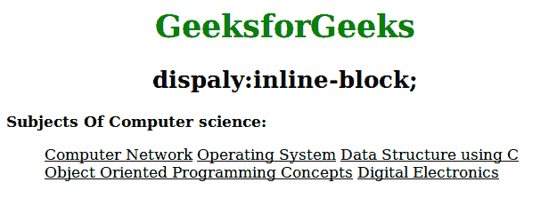

# 如何用 CSS 防止项目列表出现断行？

> 原文:[https://www . geesforgeks . org/如何使用-css/](https://www.geeksforgeeks.org/how-to-prevent-line-breaks-in-the-list-of-items-using-css/) 防止项目列表中出现换行符

display:inline-block 属性用于显示内联级块容器中的元素。它将元素块转换为内联元素。使用高度和宽度属性设置内联元素。display 属性用于防止项目列表换行。

**语法:**

```html
element {
    display:inline-block;
} 
```

**示例:**

```html
<!DOCTYPE html>                        
<html>
    <head>
        <title>preventline break in list items</title>
        <style>
            li {
                display:inline-block;
                text-decoration:underline;
            }
            h1 {
                color:green;
            }
            h1, h2 {
                text-align:center;
            }
            body {
                width:70%;
            }
        </style>
    </head>
    <body>
        <h1>GeeksforGeeks</h1>
        <h2>display:inline-block;</h2>
        <b>Subjects Of Computer science:</b>
        <ul>
            <li>Computer Network</li>
            <li>Operating System </li>
            <li>Data Structure using C</li>
            <li>Object Oriented Programming Concepts</li>
            <li>Digital Electronics</li>
        </ul>
    </body>
</html>                    
```

**输出:**


**支持的浏览器:**CSS 显示属性支持的浏览器如下:

*   苹果 Safari 3.1
*   谷歌 Chrome 4.0
*   Firefox 3.0
*   歌剧 7.6
*   Internet Explorer 8.0