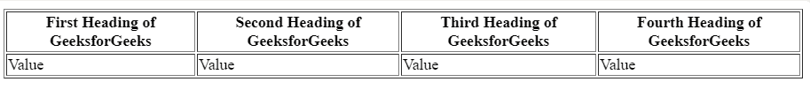
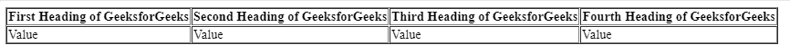
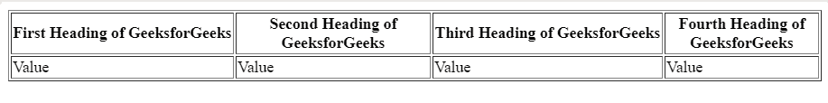

# 如何防止表格单元格中的文本使用 CSS 换行？

> 原文:[https://www . geeksforgeeks . org/如何使用 css 防止表格单元格中的文本换行/](https://www.geeksforgeeks.org/how-to-prevent-text-in-a-table-cell-from-wrapping-using-css/)

给定一个包含表头和表体部分的表。任务是防止表格单元格中的文本使用 CSS 换行。为了实现这一点，我们使用 CSS 的*空白*属性。该属性强制将 **th** 的内容显示在一行中。空白函数有许多属性值。

**语法:**

```html
white-space: normal|nowrap|pre|pre-wrap|pre-line;
```

**示例 1:** 本示例使用空白属性来防止使用 CSS 进行单元格换行。

```html
<!DOCTYPE html>
<html>
   <head>
      <meta charset="utf-8">

      <title>white-space property</title>

      <style>
         th {
            white-space: nowrap;
         }
      </style>
   </head>

   <body>
      <table border="1" collap>
         <thead>
            <tr>
               <th>First Heading of GeeksforGeeks</th>
               <th>Second Heading of GeeksforGeeks</th>
               <th>Third Heading of GeeksforGeeks</th>
               <th>Fourth Heading of GeeksforGeeks</th>
            </tr>
         </thead>

         <tbody>
            <tr>
               <td>Value</td>
               <td>Value</td>
               <td>Value</td>
               <td>Value</td>
            </tr>
         </tbody>
      </table>
   </body>
</html>
```

**输出:**
**应用空白属性前:**

**应用空白属性后:**


**示例 2:** 本示例使用内联空白属性。

```html
<!DOCTYPE html>
<html>
   <head>
      <meta charset="utf-8">

      <title>white-space property</title>
   </head>

   <body>
      <table border="1" collap>
         <thead>
            <tr>
               <th style="white-space: nowrap;">
                   First Heading of GeeksforGeeks
               </th>

               <th>Second Heading of GeeksforGeeks</th>

               <th style="white-space: nowrap;">
                   Third Heading of GeeksforGeeks
               </th>

               <th>Fourth Heading of GeeksforGeeks</th>
            </tr>
         </thead>

         <tbody>
            <tr>
               <td>Value</td>
               <td>Value</td>
               <td>Value</td>
               <td>Value</td>
            </tr>
         </tbody>
      </table>
   </body>
</html>
```

**输出:**
**应用空白属性前:**

**应用空白属性后:**
