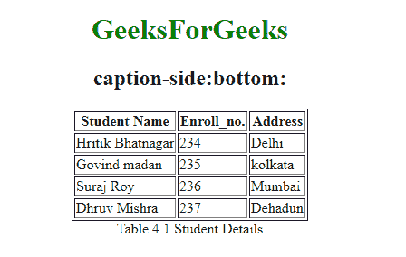

# 如何用 CSS 把标题放在表格下面？

> 原文:[https://www . geeksforgeeks . org/如何使用 css 将标题放在桌子下面/](https://www.geeksforgeeks.org/how-to-put-the-caption-below-the-table-using-css/)

为了将标题放在表格下面，我们可以使用 [CSS 标题侧属性](https://www.geeksforgeeks.org/css-caption-side-property/)。此属性用于指定表格标题的放置位置。用于 HTML [表格](https://www.geeksforgeeks.org/html-tables/)。

该属性可用于其*显示*属性设置为*字幕侧*的任何元素。这个属性有几个参数，但是我们被要求把标题放在表格下面，所以我们将使用一个单一的参数值，即*底部的*。

**语法:**

```css
caption-side: bottom;
```

**示例:**

## 超文本标记语言

```css
<!DOCTYPE html> 
<html> 
    <head> 
        <title>caption-side property</title> 
        <style> 
            .geeks { 
                caption-side: bottom; 
            } 
        </style> 
    </head> 
    <body> 
        <center> 
            <h1 style="color:green;">GeeksForGeeks</h1> 
            <h2>caption-side: bottom:</h2> 
            <table class="geeks" border="1"> 
                <caption>Table 4.1 Student Details</caption> 
                <tr> 
                    <th>Student Name</th> 
                    <th>Enroll_no.</th> 
                    <th>Address</th> 
                </tr> 
                <tr> 
                    <td>Hritik Bhatnagar</td> 
                    <td>234</td> 
                    <td>Delhi</td> 
                </tr> 
                <tr> 
                    <td>Govind madan</td> 
                    <td>235</td> 
                    <td>kolkata</td> 
                </tr> 
                <tr> 
                    <td>Suraj Roy</td> 
                    <td>236</td> 
                    <td>Mumbai</td> 
                </tr> 
                <tr> 
                    <td> Dhruv Mishra</td> 
                    <td>237</td> 
                    <td>Dehadun</td> 
                </tr> 
            </table> 
        </center> 
    </body> 
</html>                     
```

**输出:**



标题