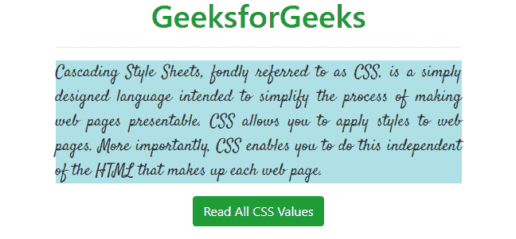
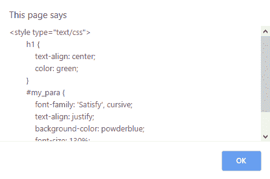
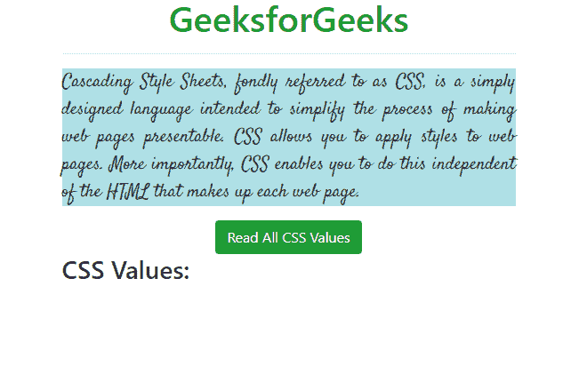
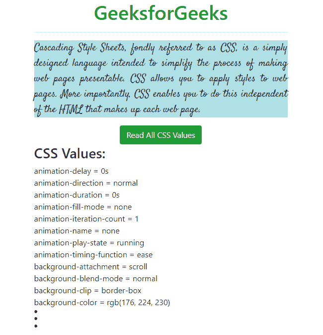

# 如何用 JavaScript 读取 CSS 规则值？

> 原文:[https://www . geesforgeks . org/how-read-CSS-rule-values-with-JavaScript/](https://www.geeksforgeeks.org/how-to-read-css-rule-values-with-javascript/)

CSS 规则可以使用 [DOM(文档对象模型)](https://www.geeksforgeeks.org/dom-document-object-model/)读取和操作。要阅读所有使用 JavaScript 的嵌入式 CSS 规则，我们可以使用以下方法。

**方法 1:**

*   使用**文档**并获取所有的 CSS 标签。
*   检查长度是否为 0，然后“未使用样式标签”。
*   否则，显示用于循环的所有标记

**示例:**

```css
<!DOCTYPE html>
<html>

<head>
    <title>CSS rule values with JS</title>
    <meta charset="utf-8">
    <meta name="viewport"
          content="width=device-width, initial-scale=1">
    <link rel="stylesheet" 
          href=
"https://maxcdn.bootstrapcdn.com/bootstrap/4.3.1/css/bootstrap.min.css">
    <link href=
"https://fonts.googleapis.com/css?family=Satisfy&display=swap" 
          rel="stylesheet">
    <style type="text/css">
        h1 {
            text-align: center;
            color: green;
        }

        #my_para {
            font-family: 'Satisfy', cursive;
            text-align: justify;
            background-color: powderblue;
            font-size: 130%;
        }
    </style>
</head>

<body>

    <div class="container">
        <h1>GeeksforGeeks</h1>
        <hr/>
        <p id="my_para">Cascading Style Sheets, fondly referred
          to as CSS, is a simply designed language intended to
          simplify the process of making web pages presentable.
          CSS allows you to apply styles to web pages. More importantly,
          CSS enables you to do this independent of the 
          HTML that makes up each web page.</p>
        <div class="text-center">
            <input id="my_button1" 
                   type="button" 
                   class="btn btn-success" 
                   value="Read All CSS Values">
        </div>
    </div>

    <script>
        function alert_css() {
            var style_text = "";
            var style_elements = document.getElementsByTagName("STYLE");
            if (style_elements.length == 0)
                alert("No Style Tag!"); 
               //or use console.log("No Style Tag!");
            else {
                for (var i = 0; i < style_elements.length; i++)
                    style_text += style_elements[i].outerHTML;
                style_text = style_text.toString().replace(/\t/g, '').split('\r\n');
                alert(style_text); 
                //or use console.log(style_text);
            }
        }
        document.getElementById("my_button1").onclick = alert_css;
    </script>

</body>

</html>
```

**输出:**

*   **之前:**
    
*   **点击【读取所有 CSS 值】按钮后:**
    

**方法 2:**

*   使用**窗口获取所有实际(计算)CSS 属性和值。**
*   借助“for 循环”显示所有 CSS 属性。

**示例:**

```css
<!DOCTYPE html>
<html>

<head>
    <title>CSS rule values with JS</title>
    <meta charset="utf-8">
    <meta name="viewport" 
          content="width=device-width, initial-scale=1">
    <link rel="stylesheet"
          href=
"https://maxcdn.bootstrapcdn.com/bootstrap/4.3.1/css/bootstrap.min.css">
    <link href=
"https://fonts.googleapis.com/css?family=Satisfy&display=swap"
          rel="stylesheet">
    <style type="text/css">
        h1 {
            text-align: center;
            color: green;
        }

        #my_para {
            font-family: 'Satisfy', cursive;
            text-align: justify;
            background-color: powderblue;
            font-size: 130%;
        }
    </style>
</head>

<body>

    <div class="container">
        <h1>GeeksforGeeks</h1>
        <hr/>
        <p id="my_para">Cascading Style Sheets, fondly referred to as
          CSS, is a simply designed language intended to simplify 
          the process of making web pages presentable. CSS allows 
          you to apply styles to web pages. More importantly, CSS 
          enables you to do this independent of the HTML that makes 
          up each web page.</p>

        <div class="text-center">
            <input id="my_button1" 
                   type="button" 
                   class="btn btn-success" 
                   value="Read All CSS Values">
        </div>
        <h3>CSS Values:</h3>
        <div id="my_div"></div>
    </div>

    <script>
        function append_css(div_name, id_name) {
            var elem = document.getElementById(id_name);
            var txt = "";
            var cssObj = window.getComputedStyle(elem, null);

            for (i = 0; i < cssObj.length; i++) {
                cssObjProp = cssObj.item(i);
                txt += cssObjProp + " = " + cssObj.getPropertyValue(cssObjProp) + "<br>";
            }
            document.getElementById(div_name).innerHTML = txt;
        }
        document.getElementById("my_button1").addEventListener('click', function() {
            append_css("my_div", "my_para");
        }, false);
    </script>

</body>

</html>
```

**输出:**

*   **之前:**
    
*   **点击【读取所有 CSS 值】按钮后:**
    

**注意:**
一条弹出消息的字数限制是有限的，如果内容较大可能无法显示全部内容，在这种情况下，可以使用 **console.log()函数**(代码中有注释)，它会在控制台中打印相同的内容。