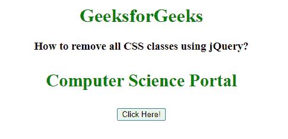
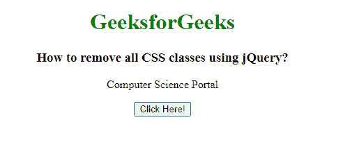

# 如何使用 jQuery 移除所有 CSS 类？

> 原文:[https://www . geesforgeks . org/how-to-remove-all-CSS-class-use-jquery/](https://www.geeksforgeeks.org/how-to-remove-all-css-classes-using-jquery/)

在本文中，我们将使用 jQuery 移除一个元素的所有 CSS 类。要移除元素的所有 CSS 类，我们使用 removeClass()方法。

removeClass()方法用于从选定的元素中移除一个或多个类名。

**语法:**

```css
$(selector).removeClass(class_name, function(index, class_name))
```

**参数:**该函数接受两个参数，如上所述，如下所述:

*   **类名:**可选参数，用于指定要删除的类名(一个或多个类)。用空格分隔的多个类名。
*   **函数:**为可选参数，返回一个或多个需要删除的类名。
    1.  **索引:**此参数用于返回元素的索引。
    2.  **current_class_name:** 此参数返回所选元素的类名。

**示例:**

## 超文本标记语言

```css
<!DOCTYPE html>
<html lang="en">

<head>
    <title>
        How to remove all CSS classes using jQuery?
    </title>

    <style>
        .GFG1 {
            color: green;
        }

        .GFG2 {
            font-size: 30px;
            font-weight: bold;
        }
    </style>

    <!-- Import jQuery cdn library -->
    <script src=
"https://ajax.googleapis.com/ajax/libs/jquery/3.3.1/jquery.min.js">
    </script>

    <script>
        $(document).ready(function () {
            $("button").click(function () {
                $("p").removeClass();
            });
        });
    </script>
</head>

<body style="text-align: center;">
    <h1 style="color: green;">
        GeeksforGeeks
    </h1>

    <h3>
        How to remove all CSS classes using jQuery?
    </h3>

    <p class="GFG1 GFG2">
        Computer Science Portal
    </p>

    <button>Click Here!</button>
</body>

</html>
```

**输出:**

**按钮点击前:**



**按钮点击后:**

