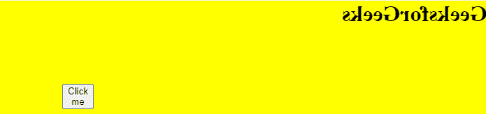
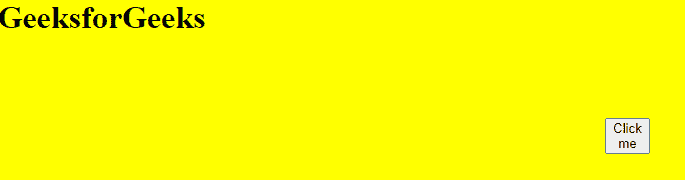
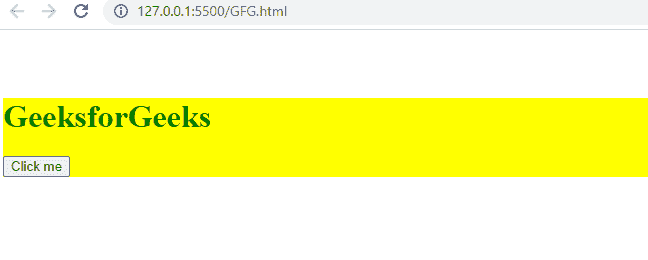
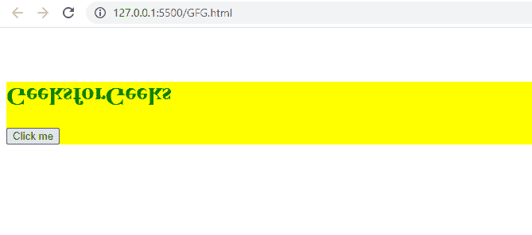

# 如何移除应用的 CSS 变换？

> 原文:[https://www . geesforgeks . org/how-remove-applied-CSS-transformation/](https://www.geeksforgeeks.org/how-to-remove-applied-css-transformation/)

在本文中，我们将学习如何移除应用的 CSS 转换。CSS 变换属性用于对元素应用二维或三维变换。此属性可用于旋转、缩放、移动甚至倾斜元素。

**语法:**

```css
transform: value;
```

为了移除应用的 CSS 转换，我们将使用 JavaScript。当我们点击按钮时使用 JavaScript，它将从元素中移除该类。以下是上述方法的全面实施。

**例:1**

## 超文本标记语言

```css
<!DOCTYPE html>
<html lang="en">

<head>
  <!-- jquery cdn -->
  <script src=
"https://ajax.googleapis.com/ajax/libs/jquery/3.5.1/jquery.min.js">
  </script>
  <style>
    .parent {
      background-color: yellow;
      margin: 5% auto;
    }
    /* Transition applied */
    .transition_apply {
      transform: rotateY(180deg);
    }
  </style>
</head>

<body>
  <div class="parent">
    <h1 class="transition_apply">
      GeeksforGeeks
    </h1>

    <button class="element">
      Click me
    </button>
  </div>

  <script>
    // When click on button this function is involked
    $(".element").on("click", function () {

      // If class is transition_apply then 
      if ($(".transition_apply").hasClass("transition_apply")) {

        // remove this class to remove transition
        $(".transition_apply").removeClass("transition_apply");
      }
    });
  </script>
</body>

</html>
```

**输出:**

*   在点击按钮之前:

    

*   点击按钮后:

    

**例 2:**

## 超文本标记语言

```css
<!DOCTYPE html>
<html lang="en">

<head>
  <!-- jquery cdn -->
  <script src=
"https://ajax.googleapis.com/ajax/libs/jquery/3.5.1/jquery.min.js">
  </script>

  <style>
    .parent {
      background-color: yellow;
      margin: 5% auto;
      color: green;
    }
    /* Transition applied rotate in x-axis */
    .transition_apply {
      transform: rotateX(-180deg);
    }
  </style>
</head>

<body>
  <div class="parent">
    <h1 class="gfg">
      GeeksforGeeks
    </h1>
    <button class="element">
      Click me
    </button>
  </div>

  <script>
    // When click on button this function is involked
    $(".element").on("click", function () {

      // If class is transition_apply then 
      if ($(".transition_apply").hasClass("transition_apply")) {

        // remove this class to remove transition
        $(".transition_apply").removeClass("transition_apply");
      }
      else{
        // Add class
        $(".gfg").addClass("transition_apply");
      }
    });
  </script>
</body>

</html>
```

**输出:**

*   在点击按钮之前:

    

*   点击按钮后:

    