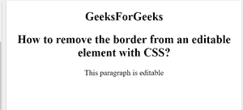
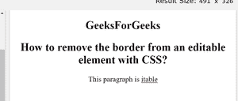

# 如何使用 CSS 移除可编辑元素的边框？

> 原文:[https://www . geeksforgeeks . org/如何使用-css/](https://www.geeksforgeeks.org/how-to-remove-border-from-an-editable-element-using-css/) 从可编辑元素中移除边框

给定一个包含一些文档的 HTML 文档，任务是使用 CSS 从可编辑元素中移除边框。这是任何内容可编辑属性设置为 true 的元素的默认行为，只要元素获得焦点，它就会在它们周围获得边框。使用**【属性】选择器**选择所有内容可编辑的元素，去掉**轮廓**属性的边框，即可完成任务。

**示例:**

## 超文本标记语言

```css
<!DOCTYPE html>
<html>

<head>
    <style>
        [contenteditable] {
            outline: 0px solid transparent;
        }
    </style>
</head>

<body>
    <center>
        <h2>GeeksForGeeks</h2>

        <h2>
            How to remove the border from 
            an editable element with CSS?
        </h2>

        <p contenteditable="true">
            This paragraph is editable
        </p>

    </center>
</body>

</html>
```

**输出:**

**编辑元素前:**



**在元素上编辑后:**

