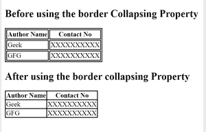

# 如何使用 CSS 删除表格中的单元格间距？

> 原文:[https://www . geeksforgeeks . org/如何使用-css/](https://www.geeksforgeeks.org/how-to-remove-cellspacing-from-tables-using-css/) 从表中删除单元格间距

这是表格单元格的默认行为，它们的边框之间有一些空间。要删除这个空间，我们可以使用 CSS **边框折叠**属性。此属性用于设置表格中单元格的边框，并告知这些单元格是否共享公共边框。

**语法:**

```css
border-collapse: collapse; 
```

**示例:**

```css
<!DOCTYPE html> 
<html> 
    <head> 
        <title> 
         Remove cellspacing from tables using CSS
        </title> 

        <!-- border-collapse CSS property -->
        <style> 
            table, td, th { 
                border: 2px solid black; 
            } 

            #collapseTable { 
                border-collapse: collapse; 
            } 
        </style> 
    </head> 

    <body> 
        <h2> 
Before using the border Collapsing Property
        </h2> 

        <table id = "separateTable"> 
            <tr> 
                <th>Author Name</th> 
                <th>Contact No</th> 
            </tr> 
            <tr> 
                <td>Geek</td> 
                <td>XXXXXXXXXX</td> 
            </tr> 
            <tr> 
                <td>GFG</td> 
                <td>XXXXXXXXXX</td> 
            </tr> 
        </table> 

        <h2> 
After using the border collapsing Property
        </h2> 

        <table id = "collapseTable"> 
            <tr> 
                <th>Author Name</th> 
                <th>Contact No</th> 
            </tr> 
            <tr> 
                <td>Geek</td> 
                <td>XXXXXXXXXX</td> 
            </tr> 
            <tr> 
                <td>GFG</td> 
                <td>XXXXXXXXXX</td> 
            </tr> 
        </table> 
    </body> 
</html>
```

**输出**



**支持的浏览器 a** 如下所示:

*   谷歌 Chrome
*   微软公司出品的 web 浏览器
*   火狐浏览器
*   歌剧