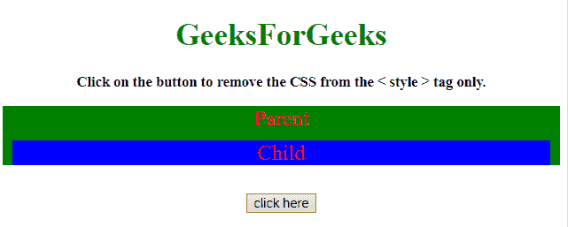
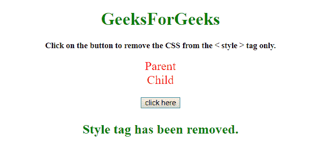

# 如何用 JavaScript/jQuery 去掉`<style>`标签的 CSS 样式？

> 原文:[https://www . geesforgeks . org/how-remove-CSS-style-of-style-tag-use-JavaScript-jquery/](https://www.geeksforgeeks.org/how-to-remove-css-style-of-style-tag-using-javascript-jquery/)

给定一个包含内嵌和内部 CSS 的 HTML 文档，任务是移除

**方法:****jQuery[remove()](https://www.geeksforgeeks.org/jquery-remove/)和 [empty()](https://www.geeksforgeeks.org/jquery-empty-with-examples/)** 方法用于移除<样式>元素的 CSS 样式。

**示例 1:** 本示例使用 **[remove()方法](https://www.geeksforgeeks.org/jquery-remove/)** 移除<样式>元素的 CSS 样式。

```css
<!DOCTYPE HTML>  
<html>  

<head>  
    <title>  
        How to remove CSS style of style
        tag using JavaScript/jQuery ?
    </title>

    <script src=
"https://ajax.googleapis.com/ajax/libs/jquery/3.4.1/jquery.min.js">
    </script>

    <style>
        .parent {
            background: green;
        }
        .child {
            background: blue;
            margin: 10px;
        }
    </style>
</head>  

<body style = "text-align:center;">  

    <h1 style = "color:green;" >  
        GeeksForGeeks  
    </h1> 

    <p id = "GFG_UP" style = 
        "font-size: 15px; font-weight: bold;"> 
    </p>

    <div class="parent" id = "parent" 
            style = "color: red; font-size: 22px">
        Parent
        <div class="child">
            Child
        </div>
    </div>
    <br>

    <button onclick = "GFG_Fun()">
        click here
    </button>

    <p id = "GFG_DOWN" style = 
        "font-size: 24px; font-weight: bold; color: green;"> 
    </p>

    <script>  
        var up = document.getElementById('GFG_UP');
        var down = document.getElementById('GFG_DOWN');
        var parent = document.getElementById('parent');

        up.innerHTML = "Click on the button to remove "
            + "the CSS from the < style > tag only."; 

        function GFG_Fun() {
            $('style').remove();
            down.innerHTML = "Style tag has been removed.";
        } 
    </script>  
</body>  

</html>
```

**输出:**

*   **点击按钮前:**
    
*   **点击按钮后:**
    

**示例 2:** 本示例使用 **jQuery [empty()方法](https://www.geeksforgeeks.org/jquery-empty-with-examples/)** 移除<样式>元素的 CSS 样式。

```css
<!DOCTYPE HTML>  
<html>  

<head>  
    <title>  
        How to remove CSS style of style
        tag using JavaScript/jQuery ?
    </title>

    <script src=
"https://ajax.googleapis.com/ajax/libs/jquery/3.4.1/jquery.min.js">
    </script>

    <style>
        .parent {
            background: green;
        }
        .child {
            background: blue;
            margin: 10px;
        }
    </style>
</head>  

<body style = "text-align:center;">  

    <h1 style = "color:green;" >  
        GeeksForGeeks  
    </h1> 

    <p id = "GFG_UP" style = 
        "font-size: 15px; font-weight: bold;"> 
    </p>

    <div class="parent" id = "parent" 
            style = "color: red; font-size: 22px">
        Parent
        <div class="child">
            Child
        </div>
    </div>
    <br>

    <button onclick = "GFG_Fun()">
        click here
    </button>

    <p id = "GFG_DOWN" style = 
        "font-size: 24px; font-weight: bold; color: green;"> 
    </p>

    <script>  
        var up = document.getElementById('GFG_UP');
        var down = document.getElementById('GFG_DOWN');
        var parent = document.getElementById('parent');

        up.innerHTML = "Click on the button to remove the"
                + " CSS from the < style > tag only."; 

        function GFG_Fun() {
            $('style').empty();
            down.innerHTML = "Style tag has been removed.";
        } 
    </script>  
</body>  

</html>
```

**输出:**

*   **点击按钮前:**
    
*   **点击按钮后:**
    