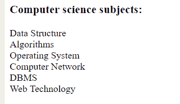

# 如何用 CSS 去除无序列表项的缩进？

> 原文:[https://www . geeksforgeeks . org/如何使用 css 从无序列表中移除缩进/](https://www.geeksforgeeks.org/how-to-remove-indentation-from-an-unordered-list-item-using-css/)

在设计网页时，我们习惯于添加一些项目列表，有时它们是有编号的(各种样式)，有时它们是有项目符号的(各种样式)。这可能发生在我们试图设计一个导航栏或任何种类的列表，其中的项目既没有编号也没有项目符号，我们不需要数字或项目符号，也没有空白。要从无序列表(包含项目符号的列表)中移除缩进，需要使用 CSS 进行样式化。样式将只在列表中实现。所以选择器应该是 ul 的。

**语法:**

```html
ul {
    // CSS Property
}
```

**示例:**本示例创建一个列表缩进为零(0)的页面。

```html
<!DOCTYPE html>
<html>

<head>
    <title>
        Remove indentation from an 
        unordered list of items
    </title>

    <!-- CSS style to remove indentation
    from list of items -->
    <style>
        ul {
            list-style:none;
            padding-left:0;
        }
    </style>
</head>

<body>
    <h3>Computer science subjects:</h3>
    <ul>
        <li>Data Structure</li>
        <li>Algorithms</li>
        <li>Operating System</li>
        <li>Computer Network</li>
        <li>DBMS</li>
        <li>Web Technology</li>
    </ul>
</body>

</html>                    
```

**输出:**


在上例中，**左填充**属性用于设置从左缩进。左填充:0 用于删除左边的缩进(空格)。list-style: none 属性用于从项目列表中移除 list-style 属性。