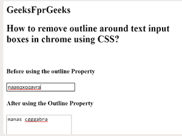

# 如何用 CSS 去除 chrome 中文字输入框周围的轮廓？

> 原文:[https://www . geeksforgeeks . org/如何删除文本输入框周围的轮廓-在 chrome-use-CSS/](https://www.geeksforgeeks.org/how-to-remove-outline-around-text-input-boxes-in-chrome-using-css/)

通常在谷歌浏览器的情况下，当输入字段获得焦点时，蓝色轮廓出现在输入字段的边界上。使用 **CSS 轮廓**属性可以完成任务。

**示例:**

## 超文本标记语言

```css
<html>
<head> 
  <title>
        How to remove outline around text
    input boxes in chrome using CSS?

  </title>
<style>
textarea:focus{
        outline: none;
    }

</style>
  <body>
      <h2>
          GeeksFprGeeks
      </h2>
      <h2>
          How to remove outline around text
    input boxes in chrome using CSS?

      </h2><br>
      <h4><b> Before using the outline Property</b></h4>

          <input type="text">
          <h4><b>After using the Outline Property</b></h4>
    <textarea rows="4"></textarea>
  </body>
</head></html>
```

**输出**



**支持的浏览器如下:**

*   谷歌 Chrome
*   微软公司出品的 web 浏览器
*   火狐浏览器
*   歌剧