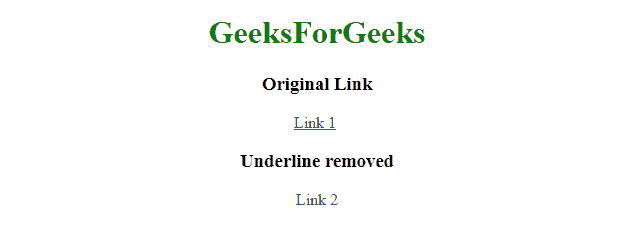
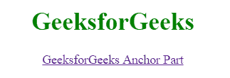

# 如何用 CSS 去除锚点标签的下划线？

> 原文:[https://www . geesforgeks . org/how-remove-下划线-for-anchors-tag-use-CSS/](https://www.geeksforgeeks.org/how-to-remove-underline-for-anchors-tag-using-css/)

锚点标签用于定义超链接，默认情况下，它显示带下划线的锚点部分。使用文本修饰属性可以很容易地删除下划线。CSS 的文本修饰属性允许根据需要修饰文本。通过将文本装饰设置为“无”来移除锚点标签的下划线。

**语法:**

```html
text-decoration: none;
```

**示例 1:** 本示例将文本装饰属性设置为无。

```html
<!-- HTML code to remove underline
    from anchor tag -->
<!DOCTYPE html> 
<html> 

<head> 
    <title> 
        text-decoration property 
    </title>

    <!-- text-decoration property to remove
        underline from anchor tag -->
    <style>
        #GFG {
            text-decoration: none;
        }
    </style>
</head> 

<body style = "text-align:center;"> 

    <h1 style = "color:green;" > 
        GeeksForGeeks 
    </h1>

    <h3>Original Link</h3>

    <a href = "#">Link 1</a>

    <br> 

    <h3>removed Underline</h3>

    <a id = "GFG" href = "#">Link 2</a> 
</body> 

</html>                    
```

**输出:**


**示例 2:** 当鼠标移动到锚点部件上时，使用悬停属性移除下划线。

```html
<!-- HTML code to remove underline
    from anchor tag -->
<!DOCTYPE html> 
<html> 

<head> 
    <title> 
        text-decoration property 
    </title>

    <!-- text-decoration property to remove
        underline from anchor tag -->
    <style>
        a:link {
            text-decoration: underline;
        }
        a:hover {
            text-decoration: none;
        }
    </style>
</head> 

<body style = "text-align:center;"> 

    <h1 style = "color:green;" > 
        GeeksforGeeks 
    </h1>

    <a id = "GFG" href = "#">GeeksforGeeks Anchor Part</a> 
</body> 

</html>                    
```

**输出:**
**鼠标移过前:**

**鼠标移过后:**
