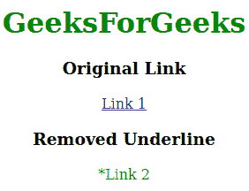
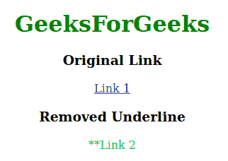
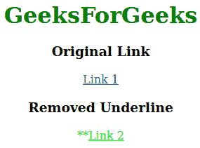

# 如何在使用 CSS 之前去掉 a:的下划线？

> 原文:[https://www . geeksforgeeks . org/如何删除-before-use-CSS/](https://www.geeksforgeeks.org/how-to-remove-underline-from-abefore-using-css/)

**a:before** 用于在锚点标签的内容之前创建一个元素，默认情况下，它显示带下划线的 a:before part。在使用 CSS 的文本装饰属性并将元素显示设置为内联块之前，从:中移除下划线。

**语法:**

```html
text-decoration:none;
display:inline-block;
```

**示例 1:** 本示例将文本装饰属性设置为无。

```html
<!DOCTYPE html>
<html>

<head>
    <title>
        How to remove underline
        from a:before using CSS?
    </title>

    <style>
        #test a {
            color: #05ff05;
            text-decoration: none;
        }

        #test a:before {
            color: #05ff05;
            content: "* ";
            text-decoration: none;
            display: inline-block;
        }
    </style>
</head>

<body style="text-align:center;">
    <h1 style="color:green;">GeeksForGeeks</h1>
    <h3>Original Link</h3>
    <a href="https://www.geeksforgeeks.org/">Link 1</a>
    <br>
    <div id="test">
        <h3>Removed Underline</h3>
        <a id="GFG" href="https://www.geeksforgeeks.org/">
            Link 2
        </a>
    </div>
</body>

</html>
```

**输出:**


**示例 2:** 当鼠标移动到 a:before 部分上时，本示例使用悬停属性移除下划线。

```html
<!DOCTYPE html>
<html>

<head>
    <title>
        How to remove underline
        from a:before using CSS?
    </title>

    <style>
        #test a {
            color: #05ff05;
        }

        #test a:hover {
            color: #05ff05;
            text-decoration: none;
        }

        #test a:before {
            color: #05ff05;
            content: "**";

        }

        #test a:before:hover {
            color: #05ff05;
            content: "**";
            display: inline-block;
            text-decoration: none;
        }
    </style>
</head>

<body style="text-align:center;">
    <h1 style="color:green;">GeeksForGeeks</h1>
    <h3>Original Link</h3>
    <a href="https://www.geeksforgeeks.org/">Link 1</a>
    <br>
    <div id="test">
        <h3>Removed Underline</h3>
        <a id="GFG" href="https://www.geeksforgeeks.org/">
            Link 2
        </a>
    </div>
</body>

</html>
```

**输出:**


**示例 3:** 本示例仅删除:部分之前的下划线。

```html
<!DOCTYPE html>
<html>

<head>
    <title>
        How to remove underline
        from a:before using CSS?
    </title>

    <style>
        #test a {
            color: #05ff05;

        }

        #test a:before {
            color: #05ff05;
            content: "**";
            display: inline-block;
            text-decoration: none;
        }
    </style>
</head>

<body style="text-align:center;">
    <h1 style="color:green;">GeeksForGeeks</h1>
    <h3>Original Link</h3>
    <a href="https://www.geeksforgeeks.org/">Link 1</a>
    <br>
    <div id="test">
        <h3>Removed Underline</h3>
        <a id="GFG" href="https://www.geeksforgeeks.org/">
            Link 2
        </a>
    </div>
</body>

</html>
```

**输出:**
