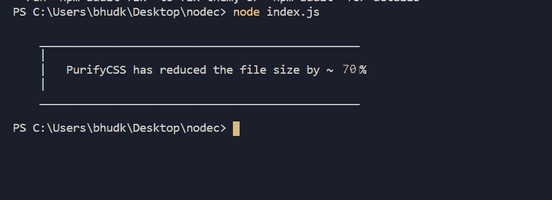

# 如何从网站中移除未使用的 CSS？

> 原文:[https://www . geesforgeks . org/如何从您的网站中删除未使用的 CSS/](https://www.geeksforgeeks.org/how-to-remove-unused-css-from-your-website/)

网站的 CSS 文件有时会变得很大。这主要发生在您构建新类时，而不删除您现在已经停止使用的旧类，这使得 CSS 文件对于其他贡献者来说非常混乱，难以理解和修改。

如果您使用 WordPress 中预先构建的主题，也可能发生这种情况。在这里，我们将知道如何以合理的比例减少您的 CSS 文件大小。有一些工具可以删除未使用的 CSS。这里，我们将使用 **PurifyCSS** 。

**先决条件:**

*   您需要安装节点，它将用于执行代码。下载并安装[节点](https://nodejs.org/en/download/)，这将包括内置的包管理器 NPM。
*   您还需要任何文本编辑器，如果您没有，请尝试使用 [Visual Studio Code](https://code.visualstudio.com/download) 。

**了解 PurifyCSS 的工作原理:** PurifyCSS 通过一系列 CSS 文件获取所有 HTML 文件。这意味着我们不能只提供我们的*index.html*文件，因为我们的网站上可能有不同的 HTML 文件通过一系列模板呈现。然后，HTML 文件列表将检查所提供的 CSS 文件，如 *style.css* 和 *custom.css* 。在您的情况下，可能会有所不同，只要想想您的哪些文件使用了相同的 CSS 文件。类似的页面将通过 CSS 文件进行检查。如果没有完成，那么我们可能会丢失所需的 CSS 文件。

**安装 PurifyCSS:** 安装 Node 并访问其包管理器 NPM。PurifyCSS 有一个内置的 NPM 软件包供安装，通过在项目文件夹根目录下的终端中运行下面的命令来安装它:

```
npm i -D purify-css

```

**准备我们的文件:**我们将需要一些 HTML 文件以及它们的 CSS 文件。在我们的例子中，我们假设我们的 CSS 的主要部分在 *style.css* 文件中。

在根目录中，我们为每个要处理的 HTML 布局创建一个 HTML 文件:

*   主页
*   实践
*   内容
*   实习
*   轮廓
*   工作

创建与我们的网站匹配的模板文件后，只需将它们复制并粘贴到我们在目录中创建的新文件中。然后我们对 CSS 文件做同样的事情。

purify 工具的根目录如下所示:

*   node_modules/
*   practice.html
*   contests.html
*   index.html
*   internships.html
*   profile.html
*   jobs.html
*   style.css

**创建 JavaScript 净化器:**现在，创建一个新的。在根目录下的 js 文件，就像 *purifyMyCSS.js.* 把下面的 JavaScript 代码添加到文件中。

```
const purify = require("purify-css")

// Reference of all HTML files from root directory
let content = ['*.html'];

// Reference of all CSS files from root directory
let css = ['*.css'];

let files = {

    // Write purified CSS into a file
    output: 'purified.css',
    minified: true, // Minify boolean
    info: true  // Output information
};

purify(content, css, files, function (purifiedAndMinifiedResult) {
    console.log(purifiedAndMinifiedResult);
});
```

这对 PurifyCSS 的工作来说已经足够了。现在只需使用 Node 运行代码。

**净化:**按照上述步骤操作后，可以在根目录级别的终端中运行以下代码来删除未使用的 CSS:

```
node purifyMyCss.js

```

就是这样，你会得到类似如下的输出:



现在，您将获得一个名为 purified.css 的新 css 文件，只需复制该文件的内容并将其粘贴到您网站的 CSS 文件中。

**总结:**
PurifyCSS 从我们的文件中减少了大约 70%的未使用 CSS，如果你有一个像 [GeeksforGeeks](https://www.geeksforgeeks.org/) 这样的大型网站，这是相当多的。但是，如果你有一个单页网站，那么你不需要遵循所有这些步骤。你可以使用各种免费的在线工具。其中之一是 UNCSS，它允许您在一个输入中粘贴 HTML 内容，在另一个输入中粘贴 CSS 内容。点击按钮，你的短 CSS 将被添加到输出框中，复制并粘贴到你想要的位置。