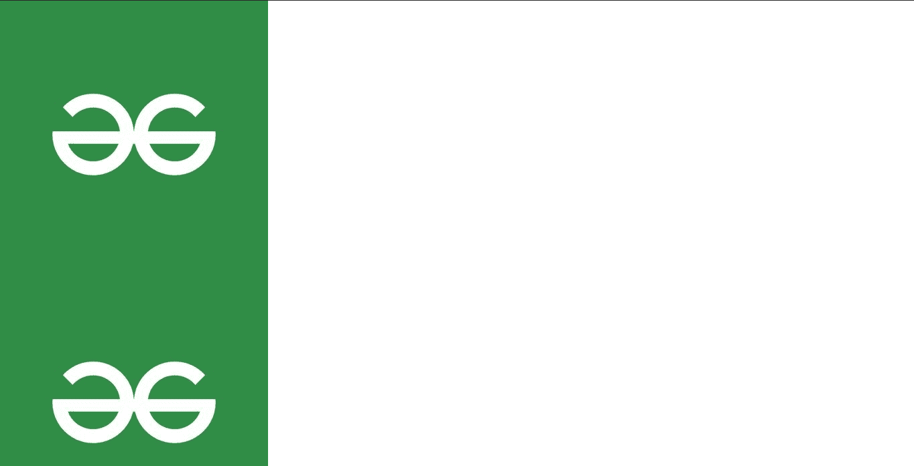

# 如何使用 CSS 纵横重复背景图像？

> 原文:[https://www . geesforgeks . org/how-repeat-background-image-垂直和水平-使用-css/](https://www.geeksforgeeks.org/how-to-repeat-background-image-vertically-and-horizontally-using-css/)

在本文中，我们将讨论 CSS 的背景图像重复属性。另外，我们将讨论如何在水平和垂直方向重复背景图像。

CSS 中的 **[背景-重复属性](https://www.geeksforgeeks.org/css-background-repeat-property/)** 用于水平和垂直重复背景图像。它还决定背景图像是否重复。

**背景-重复:**该属性用于水平和垂直重复背景图像。如果最后一个图像不适合浏览器窗口，它将被剪切。

**语法**

```
background-repeat: repeat|repeat-x|repeat-y|
no-repeat|initial|inherit;
```

**例 1:** 让我们水平重复图像。这里我们将使用之前使用的相同属性。

**重复-x** 该属性用于水平重复背景图像。

**语法:**

```
element {
   background-repeat: repeat-x;
}
```

## 超文本标记语言

```
<!DOCTYPE html>
<html lang="en">
<head>
    <meta charset="UTF-8">
    <meta http-equiv="X-UA-Compatible" content="IE=edge">
    <meta name="viewport" 
          content="width=device-width, initial-scale=1.0">
    <style>
        body{
            background-image: url(
"https://media.geeksforgeeks.org/wp-content/cdn-uploads/20210325121930/QNHrwL2q.jpg");
            background-repeat: repeat-x;
        }
    </style>
</head>
<body>

</body>
</html>
```

**输出:**正如你在输出中看到的，图像现在是水平重复的。
T3】

**示例 2:** 现在让我们垂直重复图像。**重复-y** 属性用于设置仅垂直重复的背景图像。

**语法:**

```
element {
   background-repeat: repeat-y;
}
```

## 超文本标记语言

```
<!DOCTYPE html>
<html lang="en">
<head>
    <meta charset="UTF-8">
    <meta http-equiv="X-UA-Compatible" content="IE=edge">
    <meta name="viewport" 
          content="width=device-width, initial-scale=1.0">
    <style>
        body{
            background-image: url("
https://media.geeksforgeeks.org/wp-content/cdn-uploads/20210325121930/QNHrwL2q.jpg");
            background-repeat: repeat-y;
        }
    </style>
</head>
<body>

</body>
</html>
```

**Output:**Now the image is repeating vertically.
