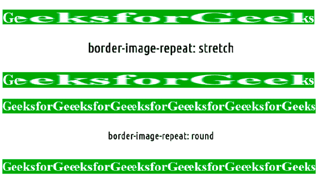
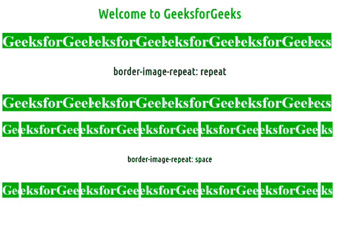
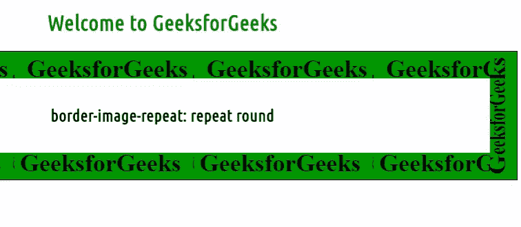

# 如何使用 CSS 重复边框图像？

> 原文:[https://www . geesforgeks . org/how-repeat-border-image-use-CSS/](https://www.geeksforgeeks.org/how-to-repeat-border-image-using-css/)

您可以使用 CSS 中的[边框-图像-重复](https://www.geeksforgeeks.org/css-border-image-repeat-property/)属性来重复边框图像。它通常用于缩放和平铺边框图像。它用于将边框图像的中间部分与边框的大小相匹配。

**语法:**

```html
border-image-repeat: stretch|repeat|round|initial|inherit
```

**注意:**[**边框-图像-切片**](https://www.geeksforgeeks.org/css-border-image-slice-property/) 属性用于分割或切片由[边框-图像-源](https://www.geeksforgeeks.org/css-border-images/)属性指定的图像。

**例 1:**

## 超文本标记语言

```html
<!DOCTYPE html>
<html>
    <head>

        <!-- CSS property -->
        <style>
            h1 {
                border: 40px solid transparent;
                padding: 40px;
                border-image-source:url(
https://media.geeksforgeeks.org/wp-content/uploads/border1-2.png);
                border-image-repeat: stretch;
                border-image-slice: 40;
                text-align:center;
            }

            h2{
                border: 40px solid transparent;
                padding: 40px;
                border-image-source:url(
https://media.geeksforgeeks.org/wp-content/uploads/border1-2.png);
                border-image-repeat: round;
                border-image-slice: 50;
                text-align:center;
            }
        </style>
    </head>

    <body>
        <h1>border-image-repeat:stretch</h1>
        <h2>border-image-repeat:round</h2>
    </body>
</html>                    
```

**输出:**



**例 2:**

## 超文本标记语言

```html
<!DOCTYPE html>
<html>
    <head>

        <!-- CSS property -->
        <style>
               h1{
                color: green;
                text-align: center;
            }
            h2 {
                border: 40px solid transparent;
                padding: 40px;
                border-image-source:url(
https://media.geeksforgeeks.org/wp-content/uploads/border1-2.png);
                border-image-repeat: repeat;
                border-image-slice: 40;
                text-align:center;
            }

            h3{
                border: 40px solid transparent;
                padding: 40px;
                border-image-source:url(
https://media.geeksforgeeks.org/wp-content/uploads/border1-2.png);
                border-image-repeat: space;
                border-image-slice: 50;
                text-align:center;
            }
        </style>
    </head>

    <body>
          <h1>Welcome to GeeksforGeeks</h1>
        <h2>border-image-repeat: repeat</h2>
        <h3>border-image-repeat: space</h3>
    </body>
</html>        
```

**输出:**



**注意:****边框-图像-重复**属性有一个描述所有边的行为的单值语法，以及一个为水平和垂直行为设置不同值的双值语法。

**例 3:**

## 超文本标记语言

```html
<!DOCTYPE html>
<html>
    <head>

        <!-- CSS property -->
        <style>

            h1{
                color: green;
                text-align: center;
            }
            h2 {

                 border: 40px solid transparent;
                padding: 40px;
                border-image-source:url(
https://media.geeksforgeeks.org/wp-content/uploads/border2-2.png);
                border-image-repeat:  repeat round;
                border-image-slice: 40;
                text-align:center;
            }

        </style>
    </head>

    <body>
        <h1>Welcome to GeeksforGeeks</h1>
        <h2>border-image-repeat: repeat round</h1>        
    </body>
</html>            
```

**输出:**

