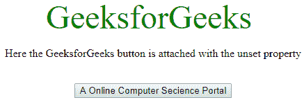
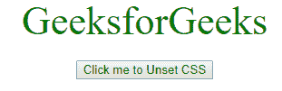
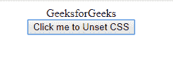

# 如何重置/移除元素的 CSS 样式？

> 原文:[https://www . geesforgeks . org/如何重置-移除-CSS-style-for-element/](https://www.geeksforgeeks.org/how-to-reset-remove-css-styles-for-element/)

浏览器对大多数 CSS 属性使用一些预定义的默认值。这些默认值可能因浏览器以及所用浏览器的版本而异。给出这些默认值是为了确保整个网页的一致性。但是在某些情况下，这些默认值会导致网页执行意外的操作，因此删除这些默认值是一种可行的方法。
在大多数情况下，可以使用一些预定义的复位方法进行复位。还有许多其他复位方法。但是这些重置方法的问题在于，它们被用来移除网页中存在的所有样式(移除所有元素及其属性的所有浏览器默认值)，但是如果我们想要仅移除一个元素的默认值或某些特定样式，那么值 *unset* 就派上了用场。
**问题陈述:**大多数情况下，网络浏览器提供的默认按钮非常平淡无奇，没有风格化。为了使它更加风格化，并使它适合网页的主题，它可以使用 CSS 手动风格化。但是在移除默认样式之前，不能应用手动样式。因此，我们应用下面的代码来移除按钮上的默认样式。
**示例 1:** 这里你会看到如何通过 HTML 和 CSS 来使用**取消设置**属性。本示例仅移除默认浏览器样式。

## 超文本标记语言

```
<!DOCTYPE html>
<html>

<head>
    <title>
        How to reset/remove CSS
        styles for element ?
    </title>

    <style>
        body {
            display: grid;
            min-height: 100vh;

        }
        .gfg {
            all: unset;
        }
        .geeks {
            color: green;
            font-size: 3rem;
        }
    </style>
</head>

<body>
    <center>
        <div class="geeks">
            <button class="gfg">
                GeeksforGeeks
            </button>
        </div>

<p>
            Here the GeeksforGeeks button is
            attached with the unset property
        </p>
<br>

        <button class="GFG">
            A Online Computer Secience Portal
        </button>
    </center>
</body>

</html>                               
```

**输出:**



**示例 2:** 这里你会看到如何通过 HTML 触发**取消设置**属性，CSS 一个 jQuery。

## 超文本标记语言

```
<!DOCTYPE html>
<html>

<head>
    <title>
        How to reset/remove CSS
        styles for element ?
    </title>

    <script src=
"https://ajax.googleapis.com/ajax/libs/jquery/3.2.1/jquery.min.js">
    </script>

    <style>
        .geeks {
            all:unset;
        }
        div {
            color: Green;
            font-size: 44px;
        }
    </style>
</head>

<body>
    <center>
        <div id="myid">
            GeeksforGeeks
        </div><br>

        <button id="gfg">
            Click me to Unset CSS
        </button>

        <script>
            $('#gfg').click(function() {
            $('#myid').addClass('geeks');
            });
        </script>
    </center>
</body>

</html>                   
```

**输出:**

*   **点击按钮前:**



*   **点击按钮后:**

