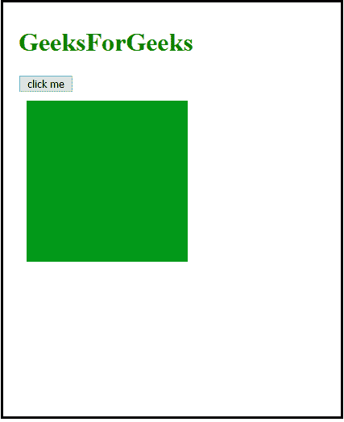
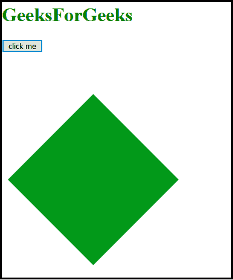

# 如何使用 CSS 调整旋转半径？

> 原文:[https://www . geesforgeks . org/如何调整大小-旋转-半径-使用-css/](https://www.geeksforgeeks.org/how-to-resize-rotation-radius-using-css/)

在动态 CSS 中，可以使用 CSS 自定义属性(变量)来调整旋转半径。由于自定义属性现在出现在 Mozilla、谷歌、Opera、苹果和微软的最新浏览器中，这绝对是一个探索和实验的好时机。

学习 [CSS 变量](https://www.geeksforgeeks.org/css-variables/)和 [CSS var()函数](https://www.geeksforgeeks.org/css-var-function/)的前提条件。

**进场:**

*   首先，定义一个名为*“–半径”*的全局自定义属性。
*   然后使用 [calc()函数](https://www.geeksforgeeks.org/css-calc-function/)计算 45°的“半径”值。在这里，您还可以根据需要使用任何其他定义的变量来计算半径。
*   它可以用来调整旋转半径。
*   然后它使用 var()函数插入自定义属性的值来旋转对象。

**注意:**可以用 JavaScript 更新一个 CSS 变量。

**示例:**

```css
<!DOCTYPE html>
<html>

<head>
    <style>
        #box {
            background-color: #029919;
            width: 200px;
            height: 200px;
            margin: 10px;
            transition: transform 1s linear;
            transform-origin: bottom left;
        }

        :root {
            --radius: calc(10 * 4.5deg);
        }

        .box-rotate {
            transform: rotate(var(--radius));
        }
    </style>
</head>

<body>
    <h1 style="color: green;">
        GeeksForGeeks
    </h1>
    <button onclick="rotate()">click me</button>
    <div id="box"></div>

    <!-- Script to add functionality  
        on button -->
    <script>
        function rotate() {
            var element = document.getElementById("box");
            element.classList.toggle("box-rotate");
        }
    </script>
</body>

</html>
```

**输出:**

*   **Before clicking the button:**

    

*   **After clicking the button:**

    