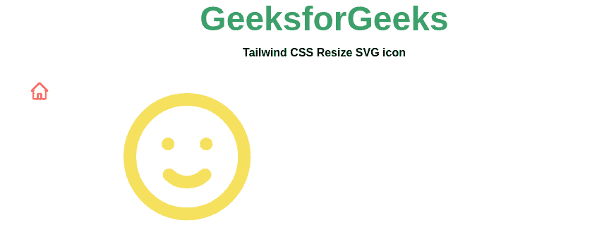
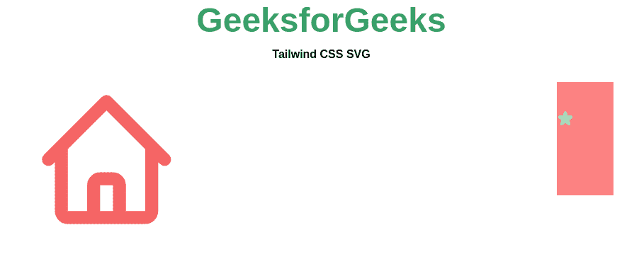

# 如何使用 Tailwind CSS 调整 SVG 图标的大小？

> 原文:[https://www . geesforgeks . org/如何调整大小-SVG-icon-using-tail wind-CSS/](https://www.geeksforgeeks.org/how-to-resize-svg-icon-using-tailwind-css/)

SVG 代表**可缩放矢量图形**，是一种基于 XML 的(可编辑的)矢量图像格式。SVG 通常用于浏览器中的图标、动画、交互式图表、图形和其他动态图形。由于它是基于 XML 的，您可以使用 Tailwind 轻松地调整 SVG 图标的大小。

**方法:**可以通过改变图标的高度和宽度，或者改变 SVG 的 viewBox 属性的值，简单的自定义 SVG 的类别。

**语法:**

```html
<svg class="h-30 w-30" viewBox="0 0 24 24">
    <path d=" "/>
</svg>
```

**注意:****视口框**属性定义了一个 SVG 视口的位置和尺寸。viewBox 属性的值是一个由四个数字组成的列表，最小 x，最小 y，宽度和高度。所以 viewBox 并不设置 SVG 的大小，它只是决定了我们将通过它看到 SVG 的框架或窗口。

**示例 1:** 使用**视图框**属性调整 SVG 图标的大小。

## 超文本标记语言

```html
<!DOCTYPE html>
<html>

<head>
    <link href=
"https://unpkg.com/tailwindcss@^1.0/dist/tailwind.min.css"
        rel="stylesheet">
</head>

<body class="text-center mx-4 space-y-2">
    <h1 class="text-green-600 text-5xl font-bold">
        GeeksforGeeks
    </h1>

    <b>Tailwind CSS Resize SVG icon</b>

    <div class=" m-4 grid grid-flow-col gap-4 p-5">

        <!--- Home Icon --->
        <svg xmlns="http://www.w3.org/2000/svg" 
            class="text-red-500" fill="none" viewBox="0 0 80 80"
            stroke="currentColor" height="100px" width="100px">
            <path stroke-linecap="round" stroke-linejoin="round" 
                stroke-width="2" d="M3 12l2-2m0 0l7-7 7 7M5 
                10v10a1 1 0 001 1h3m10-11l2 2m-2-2v10a1 1 0 
                01-1 1h-3m-6 0a1 1 0 001-1v-4a1 1 0 011-1h2a1 
                1 0 011 1v4a1 1 0 001 1m-6 0h6" />
        </svg>

        <!--- Emoji Icon --->
        <svg xmlns="http://www.w3.org/2000/svg" 
            class="text-yellow-400" fill="none" viewBox="0 0 80 80"
            stroke="currentColor">
            <path stroke-linecap="round" stroke-linejoin="round" 
                stroke-width="2" d="M14.828 14.828a4 4 0 01-5.656 
                0M9 10h.01M15 10h.01M21 12a9 9 0 11-18 0 9 9 0 
                0118 0z" />
        </svg>
    </div>
</body>

</html>
```

**输出:**



**示例 2:** 简单改变图标的类的宽度和高度。

## 超文本标记语言

```html
<!DOCTYPE html>
<html>

<head>
    <link href=
"https://unpkg.com/tailwindcss@^1.0/dist/tailwind.min.css"
        rel="stylesheet">
</head>

<body class="text-center mx-4 space-y-2">
    <h1 class="text-green-600 text-5xl font-bold">
        GeeksforGeeks
    </h1>
    <b>Tailwind CSS SVG</b>
    <div class=" m-4 grid grid-flow-col gap-4 p-5">

        <!--- Home Icon --->
        <svg xmlns="http://www.w3.org/2000/svg" 
            class=" text-red-500 h-70 w-50" viewBox="0 0 80 80" 
            fill="none" stroke="currentColor">
            <path stroke-linecap="round" stroke-linejoin="round" 
                stroke-width="2" d="M3 12l2-2m0 0l7-7 7 7M5 
                10v10a1 1 0 001 1h3m10-11l2
                2m-2-2v10a1 1 0 01-1 1h-3m-6 0a1 1 0 001-1v-4a1
                1 0 011-1h2a1 1 0 011 1v4a1 1 0 001 1m-6 0h6" />
        </svg>

        <svg xmlns="http://www.w3.org/2000/svg" 
            class="bg-red-400 text-green-300 h-40 w-20 fill-current"
            viewBox="0 0 80 80" fill="none" stroke="currentColor">
            <path stroke-linecap="round" stroke-linejoin="round" 
                stroke-width="2" d="M11.049 2.927c.3-.921 1.603-.921 
                1.902 0l1.519 4.674a1 1 0 00.95.69h4.915c.969 0 
                1.371 1.24.588 1.81l-3.976 2.888a1 1 0 00-.363 
                1.118l1.518 4.674c.3.922-.755 1.688-1.538 1.118l
                -3.976-2.888a1 1 0 00-1.176 0l-3.976 2.888c-.783
                .57-1.838-.197-1.538-1.118l1.518-4.674a1 1 0 00-
                .363-1.118l-3.976-2.888c-.784-.57-.38-1.81.588-1
                .81h4.914a1 1 0 00.951-.69l1.519-4.674z" />
        </svg>
    </div>
</body>

</html>
```

**输出:**

