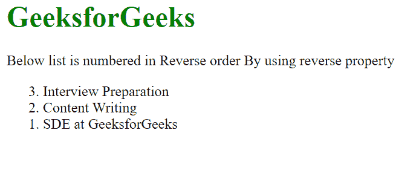
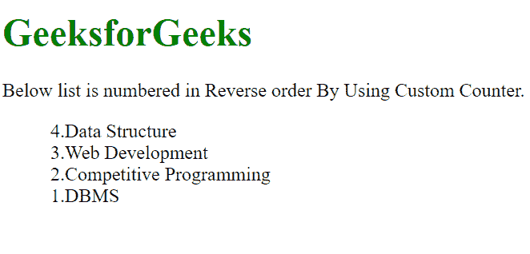

# 如何使用 CSS 反向自定义计数器？

> 原文:[https://www . geesforgeks . org/如何使用-css/](https://www.geeksforgeeks.org/how-to-reverse-custom-counters-using-css/) 反转自定义计数器

[CSS 中的计数器](https://www.geeksforgeeks.org/css-counters/)基本上是可以用于编号的变量，CSS 计数器的值可以通过 CSS 规则进行递增。跟随文章，你将了解 2 种使用 CSS 反向自定义计数器的方法。

我们将使用以下两种方法来反转计数器:

*   在方法 1 中，我们将使用如何使用 HTML 中的**反向属性**来反向简单计数器。
*   在方法 2 中，我们将最终解决如何使用 CSS **反转**自定义计数器**的问题陈述。**

**方法 1:** 使用 HTML 中的[反转属性](https://www.geeksforgeeks.org/html-ol-reversed-attribute/)反转计数器。

首先，我们将假设我们知道列表中项目的总数，因为我们将指示计数器从项目的总数开始编号，并不断减少 1，直到 0(零)，通过这一点，我们可以以相反的顺序实现编号。

**注意:**HTML**<ol>**反向属性是一个布尔属性，用于按照降序**对列表进行排序(9，8，7，6 …..)**代替升序 **(1、2、3……。).**

**语法:**

```html
<ol reversed>
   <li> Content... </li>
   <li> Content... </li>
   ...
   <li> Content... </li>
</ol>
```

下面是上述方法的实现。

**示例:**

## 超文本标记语言

```html
<!DOCTYPE html>
<html>

<body>
    <h1 style="color: green;">
        GeeksforGeeks
    </h1>

<p>
        Below list is numbered in Reverse
        order By using reverse property
    </p>

    <ol reversed>
        <li>Interview Preparation</li>
        <li>Content Writing</li>
        <li>SDE at GeeksforGeeks</li>
    </ol>
</body>

</html>
```

**输出:**



上面的例子不是自定义计数器。这是一个内置的反转计数器的方法。按照以下方法定制计数器的顺序。

**方法 2:** 使用自定义计数器反转一个计数器。下面是如何使用自定义计数器的分步实现。

**步骤 1:** 首先需要禁用默认计数器，这样就不会显示标记，这可以通过将 CSS 属性[列表样式类型设置为无来实现。](https://www.geeksforgeeks.org/css-list-style-type-property/)

**第二步:**我们需要在 CSS 中创建一个计数器，使用 counter-reset 跟踪列表中的项目数，counter-reset 创建或重置一个计数器，并设置 counter-reset =(列表中的元素总数+ 1)。增加一个元素是由于[计数器()](https://www.geeksforgeeks.org/count-number-of-step-required-to-reduce-n-to-1-by-following-certain-rule/)规则。

```html
counter-reset: myCounter (total number of element in the list + 1);
```

**步骤 3** :在内容中使用[计数器()](https://www.geeksforgeeks.org/how-to-set-the-content-as-a-counter/)功能，该功能用于以特定顺序显示内容。

```html
content: counter(myCounter);
```

**第四步:**最后，增加 CSS 计数器。您需要添加 [**计数器递增**](https://www.geeksforgeeks.org/css-counter-increment-property/) 属性，该属性用于递增/递减计数器的值，并将计数器递增= -1 设置，该属性用于将计数器减 1。实际上，count-increment 属性将整数增加 1，但是这里我们将更改该属性，将整数减少 1。

```html
counter-increment: myCounter -1;
```

**例 2:**

## 超文本标记语言

```html
<!DOCTYPE html>
<html>

<head>
    <style>
        h1 {
            color: green;
        }

        /* STEP-1 and STEP-2 */
        ol {

            /* Disable the default counters  */
            list-style-type: none;

            /* Creates a counter  */
            counter-reset: myCounter 5;
        }

        /* STEP-3 and STEP-4 */
        ol li::before {

            /* To display the content in
               a particular order. */
            content: counter(myCounter) ".";

            /* Decrease the counter by 1.*/
            counter-increment: myCounter -1;
        }
    </style>
</head>

<body>
    <h1>GeeksforGeeks</h1>

<p>
        Below list is numbered in Reverse
        order By Using Custom Counter.
    </p>

    <ol class="counter">
        <li>Data Structure</li>
        <li>Web Development</li>
        <li>Competitive Programming</li>
        <li>DBMS</li>
    </ol>
</body>

</html>
```

**输出:**

