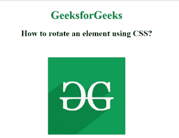
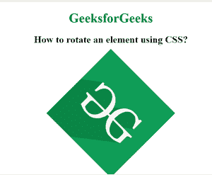

# 如何使用 CSS 旋转一个元素？

> 原文:[https://www . geeksforgeeks . org/如何使用-css 旋转元素/](https://www.geeksforgeeks.org/how-to-rotate-an-element-using-css/)

本文的目的是通过使用 **[CSS 变换属性](https://www.geeksforgeeks.org/css-transform-property/)** 来旋转一个 HTML 元素。此属性用于移动、旋转、缩放和执行元素的各种变换。

**[旋转()功能](https://www.geeksforgeeks.org/css-rotate-function/)** 可用于旋转任意 HTML 元素或用于变换。它采用一个定义旋转角度的参数。旋转角度由两部分组成，旋转值后跟旋转单位。单位可以用度数(度)、坡度(度)、弧度(弧度)和转角来定义。

**语法:**

```html
transform: rotate(90deg);
```

**示例:**以下示例演示了图像旋转 45 度。

## 超文本标记语言

```html

 <!DOCTYPE html> 
<html> 

<head>     
    <style> 
        body { 
            text-align:center; 
        } 
        h1 { 
            color:green; 
        } 
        .rotate_image { 
            transform: rotate(45deg); 
        } 
    </style> 
</head> 

<body> 
    <h1>GeeksforGeeks</h1> 
    <h2>
        How to rotate an element using CSS?
    </h2> 

      
</body> 

</html>
```

**Output:**
**Before Rotation:**

**After Rotation:**


**支持的浏览器:**

*   谷歌 Chrome
*   微软公司出品的 web 浏览器
*   火狐浏览器
*   旅行队
*   歌剧