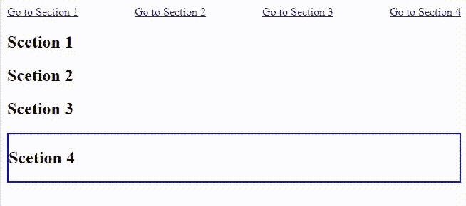
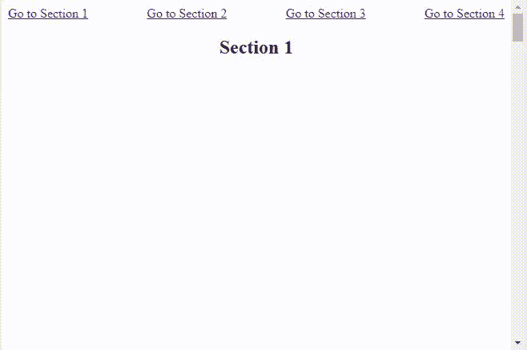

# 如何在 CSS 中滚动到特定元素或跳过内容？

> 原文:[https://www . geesforgeks . org/如何滚动到特定元素或跳过 css 中的内容/](https://www.geeksforgeeks.org/how-to-scroll-to-a-particular-element-or-skip-the-content-in-css/)

有时我们需要用户点击一个按钮或链接，并把它们带到同一个 HTML 页面上的一个元素。此外，这需要将用户带到元素，而无需任何重新加载。很多时候，用户倾向于跳到主要内容，比如游戏网站。他们可能想跳过指令，直接玩游戏。所以，基本上，我们想滚动到一个特定的元素或跳到内容。

在这篇文章中，我们将学习如何**滚动到一个特定的元素，或者只在普通的 **HTML** 和 **CSS** 中跳转到内容**。

**例 1:**

## 超文本标记语言

```html
<!DOCTYPE html>
<html lang="en">

<head>
    <meta charset="UTF-8" />
    <meta http-equiv="X-UA-Compatible" content="IE=edge" />
    <meta name="viewport" content="width=device-width, 
    initial-scale=1.0" />
    <title>Scroll</title>
    <style>
        section:target {
            border: 2px solid blue;
        }

        .links-container {
            display: flex;
            justify-content: space-between;
        }
    </style>
</head>

<body>
    <div class="links-container">

        <!-- The href attribute of anchor 
            tags point to the section IDs -->
        <!-- Note that href has to point to IDs 
            and not to classes as IDs are 
            unique in HTML-->
        <a href="#id1">Go to Section 1</a>
        <a href="#id2">Go to Section 2</a>
        <a href="#id3">Go to Section 3</a>
        <a href="#id4">Go to Section 4</a>
    </div>

    <!-- We need to specify unique IDs for 
        each section/div/element we want 
        the user to scroll to -->

    <section id="id1">
        <h1>Scetion 1</h1>
    </section>
    <section id="id2">
        <h1>Scetion 2</h1>
    </section>
    <section id="id3">
        <h1>Scetion 3</h1>
    </section>
    <section id="id4">
        <h1>Scetion 4</h1>
    </section>
</body>

</html>
```

**输出:**我们的 HTML 在浏览器窗口中会是这样的。



**示例 2:** 现在我们继续添加一些样式，这样我们就可以将各个部分放置得彼此远离。

## 超文本标记语言

```html
<!DOCTYPE html>
<html lang="en">

<head>
    <meta charset="UTF-8" />
    <meta http-equiv="X-UA-Compatible" content="IE=edge" />
    <meta name="viewport" content=
        "width=device-width, initial-scale=1.0" />

    <style>

        /* Some basic styling for 
        testing our functionality */
        .links-container {
            display: flex;
            justify-content: space-between;
        }

        .sections {
            display: flex;
            flex-direction: column;
            place-items: center;
            gap: 100rem;
        }
    </style>
</head>

<body>
    <div class="links-container">

        <!-- The href attribute of anchor 
            tags point to the section IDs -->
        <a href="#id1">Go to Section 1</a>
        <a href="#id2">Go to Section 2</a>
        <a href="#id3">Go to Section 3</a>
        <a href="#id4">Go to Section 4</a>
    </div>

    <!-- We need to specify IDs for each 
        section/div/element we want the 
        user to scroll to -->
    <div class="sections">
        <section id="id1">
            <h1>Section 1</h1>
        </section>
        <section id="id2">
            <h1>Section 2</h1>
        </section>
        <section id="id3">
            <h1>Section 3</h1>
        </section>
        <section id="id4">
            <h1>Section 4</h1>
        </section>
    </div>
</body>

</html>
```

**输出:**现在，当我们在浏览器中打开我们的 HTML 文件时，我们可以看到当我们单击任何链接时，功能都在工作，即转到第 1 部分、转到第 2 部分等。



虽然我们在跳过内容，但行为还是不流畅。您可以观察到，当我们点击链接时，我们会直接进入所需的部分。但是我们也可以让它平滑地滚动到想要的部分。

为此，我们可以在代码中使用以下代码行:

```html
scroll-behavior: smooth;
```

HTML 中还定义了其他滚动行为，你可以在这里查看它们的详细信息。在这里，我们将使用 ***平滑*** 行为。在这里，我们将使用滚动到我们想去的特定部分，只需点击一次链接。

最终代码看起来完全像这样:
**示例 3:**

## 超文本标记语言

```html
<!DOCTYPE html>
<html lang="en">

<head>
    <meta charset="UTF-8" />
    <meta http-equiv="X-UA-Compatible" content="IE=edge" />
    <meta name="viewport" content=
        "width=device-width, initial-scale=1.0" />
    <title>Scroll</title>

    <style>
        html {

            /* This property makes the html 
            page to scroll smoothly */
            /* If you want to directly move to the 
            section without scrolling, remove 
            this scroll-behavior property*/
            scroll-behavior: smooth;
        }

        /* Some basic styling for testing 
        our functionality */
        .links-container {
            display: flex;
            justify-content: space-between;
        }

        .sections {
            display: flex;
            flex-direction: column;
            place-items: center;
            gap: 100rem;
        }
    </style>
</head>

<body>
    <div class="links-container">

        <!-- The href attribute of anchor 
            tags point to the section IDs -->
        <a href="#id1">Go to Section 1</a>
        <a href="#id2">Go to Section 2</a>
        <a href="#id3">Go to Section 3</a>
        <a href="#id4">Go to Section 4</a>
    </div>

    <!-- We need to specify IDs for each 
        section/div/element we want the 
        user to scroll to -->
    <div class="sections">
        <section id="id1">
            <h1>Section 1</h1>
        </section>
        <section id="id2">
            <h1>Section 2</h1>
        </section>
        <section id="id3">
            <h1>Section 3</h1>
        </section>
        <section id="id4">
            <h1>Section 4</h1>
        </section>
    </div>
</body>

</html>
```

**输出:**正如您在输出中看到的，我们正在平滑地滚动到各个部分，并跳过内容。

