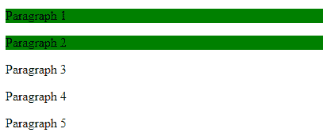

# 如何使用 CSS 递归选择所有子元素？

> 原文:[https://www . geesforgeks . org/how-select-all-child-elements-递归使用-css/](https://www.geeksforgeeks.org/how-to-select-all-child-elements-recursively-using-css/)

当一个元素是某个元素的子元素时，子选择器匹配。子选择器由两个或更多个用“>”分隔的选择器组成。它也被称为元素>元素选择器。它选择特定父元素的所有元素。

**语法:**

*   选择所有子元素。

    ```html
    element > element
    ```

*   如果子元素递归选择，则使用以下语法。

    ```html
    div.class > * {
        // CSS Property
    }
    ```

**示例 1:** 本示例选择所有子元素。

```html
<!DOCTYPE html>
<html>

<head>
    <title>
        Child element selector
    </title>

    <style>
        div > p {
            background-color: green;
        }
    </style>
</head>

<body>
    <div>
        <p>Paragraph 1</p>
        <p>Paragraph 2</p>
        <span>
            <p>Paragraph 3</p>
        </span>
    </div>

    <p>Paragraph 4</p>
    <p>Paragraph 5</p>

</body>
</html>                    
```

**输出:**


**示例 2:** 本示例递归选择所有子元素。

```html
<!DOCTYPE html>
<html>

<head>
    <title>
        Child element selector
    </title>

    <style>
        div.GFG > * {
            background-color: green;
        }
    </style>
</head>

<body>
    <div class="GFG">
        <p>Paragraph 1</p>
        <p>Paragraph 2</p>
        <span>
            <p>Paragraph 3</p>
        </span>
    </div>

    <p>Paragraph 4</p>
    <p>Paragraph 5</p>

</body>
</html>                    
```

**输出:**


CSS 是网页的基础，通过设计网站和网络应用程序用于网页开发。你可以通过以下 [CSS 教程](https://www.geeksforgeeks.org/css-tutorials/)和 [CSS 示例](https://www.geeksforgeeks.org/css-examples/)从头开始学习 CSS。