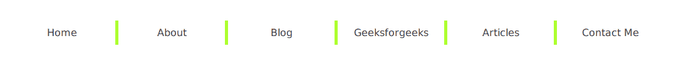
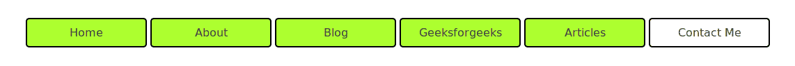

# 如何使用 CSS 选择一个元素除最后一个子元素以外的所有子元素？

> 原文:[https://www . geeksforgeeks . org/如何使用-css/](https://www.geeksforgeeks.org/how-to-select-all-children-of-an-element-except-the-last-child-using-css/) 选择一个元素的所有子元素(最后一个子元素除外)

在设计和开发 web 应用程序时，有时我们需要选择一个元素的所有子元素，除了最后一个元素。要选择一个元素除最后一个子元素之外的所有子元素，请使用**:而不是**和**:最后一个子元素**伪类。

**语法:**

```
element:not(:last-child) { 
    // CSS Style
}

```

**示例 1:** 本示例创建了一个导航菜单，除了最后一个元素之外，该菜单由右边框分隔。

```
<!DOCTYPE html>
<html>

<head>
    <title>
        Example to select all children
        except the last
    </title>

    <!-- CSS style to create nav bar -->
    <style>
        nav {
            margin: 30px;
        }
        nav a {
            text-transform: capitalize;
            text-decoration: none;
            color: rgba(60, 60, 60);
            font-family: sans-serif;
            padding: 10px 10px;
            margin-top: 30px;
            width: 150px;
            text-align: center;
            display: inline-block;
        }
        nav a:not(:last-child) {
            border-right: 5px solid greenyellow;
        }
    </style>
</head>

<body>
    <nav>
        <a href="#">Home</a>
        <a href="#">About</a>
        <a href="#">Blog</a>
        <a href="#">Geeksforgeeks</a>
        <a href="#">Articles</a>
        <a href="#">Contact Me</a>
    </nav>
</body>

</html>                    
```

**输出:**


**示例 2:** 本示例创建了一个导航菜单，并使用了除最后一个元素之外的一些 CSS 属性。

```
<!DOCTYPE html>
<html>

<head>
    <title>
        Example to select all children
        except the last
    </title>

    <!-- CSS style to create nav bar -->
    <style>
        nav {
            margin: 30px;
        }
        nav a {
            text-transform: capitalize;
            text-decoration: none;
            color: rgba(60, 60, 60);
            font-family: sans-serif;
            padding: 10px 10px;
            margin-top: 30px;
            width: 150px;
            text-align: center;
            display: inline-block;
            border: 2px solid black;
            border-radius: 5px;
        }
        nav a:not(:last-child) {
            background-color:greenyellow;
        }
    </style>
</head>

<body>
    <nav>
        <a href="#">Home</a>
        <a href="#">About</a>
        <a href="#">Blog</a>
        <a href="#">Geeksforgeeks</a>
        <a href="#">Articles</a>
        <a href="#">Contact Me</a>
    </nav>
</body>
</html>                    
```

**输出:**
