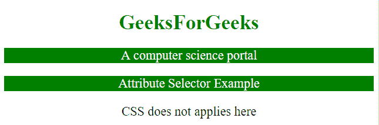

# 如何使用 CSS 按数据属性选择元素？

> 原文:[https://www . geesforgeks . org/如何使用 css 按数据属性选择元素/](https://www.geeksforgeeks.org/how-to-select-elements-by-data-attribute-using-css/)

CSS 允许选择具有特定属性或属性值的 HTML 元素。元素可以通过多种方式选择。下面给出了一些例子:

*   **【属性】:**选择指定属性的元素。
*   **【属性=“值”】:**选择具有指定属性和值的元素。
*   **【属性~=“值”】:**选择属性值包含指定单词的元素。
*   **【属性|=“值”】:**选择以指定值开始的具有指定属性的元素。
*   **【attribute^="value"]:】**选择属性值以指定值开始的元素。
*   **【属性$=“值”】:**选择属性值以指定值结束的元素。
*   **【属性*=“值”】:**选择属性值包含指定值的元素。

**示例 1:** 本示例通过使用 CSS 选择元素**【目标】**来更改< a >元素的背景颜色。

```
<!DOCTYPE html> 
<html> 

<head> 
    <title> 
        Attribute selector in CSS
    </title>

    <style>
        a[target] {
            background-color: yellow;
        }
        a {
            font-size: 20px;
        }
    </style>
</head> 

<body style = "text-align:center;"> 

    <h1 style = "color:green;" > 
        GeeksForGeeks 
    </h1> 

    <a href="https://www.geeksforgeeks.org" target="_blank">
        geeksforgeeks.org
    </a>

    <br><br>

    <a href="https://www.google.com" >
        google.com
    </a> 
</body> 

</html>                    
```

**输出:**


**示例 2:** 本示例通过使用 CSS 选择具有**【target = " _ top "】**的元素来更改< a >元素的背景色和文本色。

```
<!DOCTYPE html> 
<html> 

<head> 
    <title> 
        Attribute selector in CSS
    </title>

    <style>
        a[target=_top] {
            background-color: green;
            color: white;
        }
        a {
            font-size: 20px;
        }
    </style>
</head> 

<body style = "text-align:center;"> 

    <h1 style = "color:green;" > 
        GeeksForGeeks 
    </h1> 

    <a href="https://www.geeksforgeeks.org" target="_top" >
        geeksforgeeks.org
    </a>

    <br><br>

    <a href="https://www.google.com" >
        google.com
    </a> 
</body> 

</html>                    
```

**输出:**


**示例 3:** 本示例通过使用 CSS 选择具有**【class^="top】**的元素来更改< p >元素的背景色和文本色。

```
<!DOCTYPE html> 
<html> 

<head> 
    <title> 
        Attribute selector in CSS
    </title>

    <style>
        [class^="top"] {
            background-color: green;
            color: white;
        }
        p {
            font-size: 20px;
        }
    </style>
</head>     

<body style = "text-align:center;"> 

    <h1 style = "color:green;" > 
        GeeksForGeeks 
    </h1> 

    <p class="top-p">A computer science portal</p>
    <p class="topPara">Attribute Selector Example</p>
    <p class="Para">CSS does not applies here</p> 
</body> 

</html>                    
```

**输出:**
