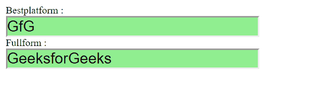
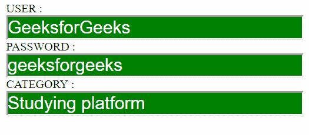

# 如何使用 CSS 选择器选择文本输入字段？

> 原文:[https://www . geesforgeks . org/如何选择-文本-输入-字段-使用-CSS-选择器/](https://www.geeksforgeeks.org/how-to-select-text-input-fields-using-css-selector/)

CSS 属性选择器用于定位一个输入文本字段。可以通过**输入【type = text】**来定位“text”类型的输入文本字段。

**注意:**规定默认属性值可能不总是可以用属性选择器选择的，可以尝试覆盖文本输入被渲染的标记的其他情况。

*   **输入:not(【类型】):**标记中不存在类型属性时使用。
*   **输入[type = "]:**当类型属性存在时使用，但为空。
*   **输入[type = text]:** 当 type 属性明确定义为‘text’时使用。

**示例 1:** 本示例选择输入文本字段并使用一些 CSS 属性。

```html
<!DOCTYPE html>
<html>

<head>
    <style>
        input[type="text"] {
            width: 400PX;
            display: block;
            background:lightgreen;
            color:black; 
            text-align:justiy; 
            font-size: 150%;
        }

        form {
            display:table-cell; 
            width:50%; 
            padding:10px; 
        }
    </style>
</head>

<body>
    <form name="input" action="" method="get">

        Bestplatform :
                <input type="text" name="Name" 
                        value="GfG" size="20">

        Fullform :
                <input type="text" name="Name" 
                    value="GeeksforGeeks" size="20">
    </form>
</body>

</html>                    
```

**输出:**


**示例 2:** 本示例选择输入文本字段并使用一些 CSS 属性。

```html
<!DOCTYPE html>
<html>

<head>

    <!-- CSS style to select type attribute -->
    <style>
        input[type="text"] {
            width: 400PX;
            display: block;
            background:green;
            color:white; 
            text-align:justiy; 
            font-size: 150%;
        }

        form {
            display:table-cell; 
            width:50%; 
            padding:10px; 
        }
    </style>
</head>

<body>
    <form name="input" action="" method="get">

        USER : <input type="text" name="Name" 
                value="GeeksforGeeks" size="20">

        PASSWORD : <input type="text" name="Name" 
                value="geeksforgeeks" size="20">

        CATEGORY : <input type="text" name="Name" 
                value="Studying platform" size="20">
    </form>
</body>

</html>                    
```

**输出:**
