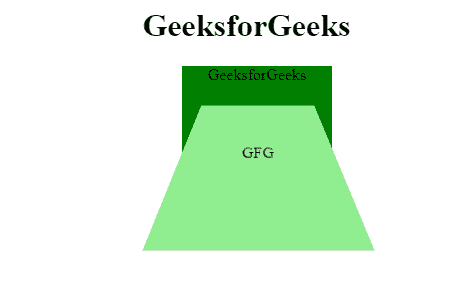

# 如何在 CSS 中设置一个 3D 元素的基础放置？

> 原文:[https://www . geesforgeks . org/how-set-a-3d-elements-base-placement-in-CSS/](https://www.geeksforgeeks.org/how-to-set-a-3d-elements-base-placement-in-css/)

任务是在 CSS 中设置三维元素的基本位置。对于此任务，您必须使用透视原点属性指定三维元素的底部位置。用分部元素创建 HTML 文件，然后在下面三个属性的帮助下定义网页的样式。

**使用的属性:**

*   [**变换风格:**](https://www.geeksforgeeks.org/css-transform-style-property/#:~:text=The%20transform%2Dstyle%20property%20is,the%20plane%20of%20the%20element.) 用于对元素应用 2D 或 3D 变换，可以旋转、缩放、移动、倾斜等。元素。
*   [**变换:**](https://www.geeksforgeeks.org/css-transform-property/#:~:text=The%20transform%20property%20in%20CSS,rotate%2C%20translate%20etc%20on%20elements.) 该属性用于指定嵌套元素在三维空间中的渲染方式。
*   [**透视原点属性:**](https://www.geeksforgeeks.org/css-perspective-origin-property/) 该属性用于定义用户从哪个位置查看 3D 定位的元素，子元素会受到影响。

**示例:**

## 超文本标记语言

```
<!DOCTYPE html>
<html>
   <head>
      <style>
      body{
          text-align:center;
      }
         .test1 {
            position: relative;
            width: 150px;
            height: 150px;
            background-color: green;
            perspective: 100px;
            margin-left: 250px;
            perspective-origin: center;
         }
         .test2 {
            position: absolute;
            padding: 60px;
            background-color: lightgreen;
            transform-style: preserve-3d;
            transform: rotatex(30deg);
         }
      </style>
   </head>
   <body>
      <h1>GeeksforGeeks</h1>
      <div class="test1">
       GeeksforGeeks
         <div class="test2">
          GFG
         </div>
      </div>
</body>
</html>
```

**输出:**

