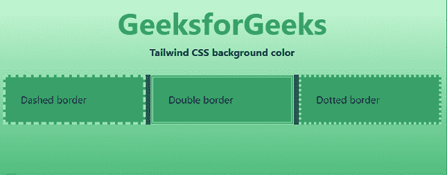

# 如何使用 Tailwind CSS 设置一个背景色为全页？

> 原文:[https://www . geeksforgeeks . org/如何使用 tailwind-css 设置背景色到整页/](https://www.geeksforgeeks.org/how-to-set-a-background-color-to-full-page-using-tailwind-css/)

在本文中，我们将学习使用[顺风 CSS 应用背景色。](https://www.geeksforgeeks.org/css-tailwind-introduction/)

**进场:**

我们可以通过简单地改变一个 HTML 主体的屏幕高度来设置一个整页的背景颜色。在 Tailwind CSS 中，我们使用了另一种 CSS 背景色 属性，表示为 [**背景色-不透明度**](https://www.geeksforgeeks.org/tailwind-css-background-color/) (例如: **bg-blue-200** )，用于指定元素的背景色。背景覆盖有填充和边框但不包括边距的元素的总大小。

**注意:**对于屏幕高度，可以使用**【h-screen】**使一个元素跨越视口的整个高度。

**语法:**

```css
<body class="h-screen bg-gradient-to-b from-green-200 to-green-500" >
```

**示例 1:** 以下示例使用 3 d *iv* s 设置 HTML 文档的全背景色

## 超文本标记语言

```css
<!DOCTYPE html>
<html>
    <head>
        <link href=
"https://unpkg.com/tailwindcss@^1.0/dist/tailwind.min.css" 
              rel="stylesheet" />
        <style>
            h2 {
                text-align: center;
            }
        </style>
    </head>

    <body class="h-screen bg-gradient-to-b
                 from-green-200 to-green-500">
        <h2 class="text-green-600 text-5xl font-bold">
            GeeksforGeeks
        </h2>
        <center>
            <b>Tailwind CSS background color</b>
        </center>
        <br />
        <div class="mx-2 grid grid-cols-3 gap-2
                    bg-blue-800 rounded-lg">
            <div class="p-6 bg-green-600 border-dashed 
                        border-4 border-green-300">
                Dashed border
            </div>
            <div class="p-6 bg-green-600 border-double
                        border-4 border-green-300">
                Double border
            </div>
            <div class="p-6 bg-green-600 border-dotted
                        border-4 border-green-300">
                Dotted border
            </div>
        </div>
    </body>
</html>
```

**输出:**



**示例 2:** 如果像上面的代码一样避免使用工具来设置像 *h-screen* 这样的元素的高度，那么通过简单地在 HTML 主体上使用背景色-不透明度(bg-blue-200)，您将得到相同的结果。

## 超文本标记语言

```css
<!DOCTYPE html>
<html>
    <head>
        <link href=
"https://unpkg.com/tailwindcss@^1.0/dist/tailwind.min.css" 
              rel="stylesheet" />
    </head>

    <body class="bg-blue-200 text-center">
        <h2 class="text-green-600 text-5xl font-bold">
            GeeksforGeeks
        </h2>
        <b>Tailwind CSS Background Color Class</b>

        <p>
            Using Tailwind CSS background color is fun
        </p>
    </body>
</html>
```

**输出:**

