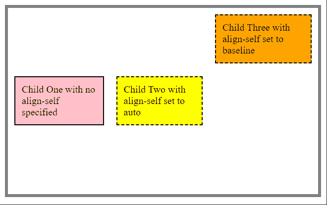
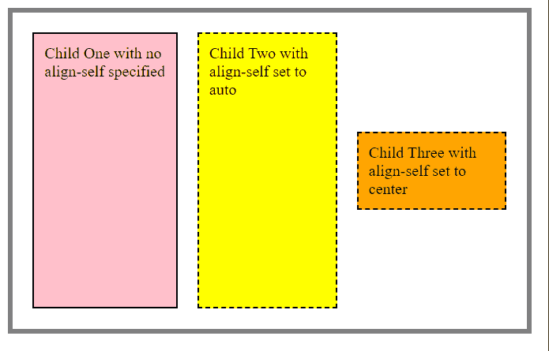

# 如何在 CSS 中将 align-self 属性设置为默认值？

> 原文:[https://www . geeksforgeeks . org/如何在 css 中设置-对齐-自身属性到其默认值/](https://www.geeksforgeeks.org/how-to-set-align-self-property-to-its-default-value-in-css/)

在本文中，我们将学习如何将 align-self 属性设置为默认值。align-self 属性用于指定父元素中选定项的对齐方式。

**方法:****自对齐属性**中的**自动**值用于设置 CSS 中的默认值。该值使该属性直接继承其父元素的行为。在这种情况下，这是不可能的，元素像使用*拉伸*属性一样拉伸。

**语法:**

```
align-self: auto
```

下面的例子演示了上述方法。

**示例 1:** 在此示例中，父容器将对齐项设置为居中。

## 超文本标记语言

```
<!DOCTYPE html>
<html>

<head>
    <style>
        #parent {
            width: 500px;
            height: 300px;
            border: 5px solid gray;
            display: flex;
            align-items: center;
        }

        #parent>div {
            padding: 10px;
            margin: 10px;
        }

        #box1 {
            border: 2px solid black;
        }

        #box2 {
            align-self: auto;
            border: 2px dashed black;
        }

        #box3 {
            align-self: baseline;
            border: 2px dashed black;
        }
    </style>
</head>

<body>
    <div id="parent">
        <div style="background-color:pink;" id="box1">
            Child One with no align-self specified
        </div>
        <div style="background-color:yellow;" id="box2">
            Child Two with align-self set to auto
        </div>
        <div style="background-color:orange;" id="box3">
            Child Three with align-self set to baseline
        </div>
    </div>
</body>

</html>
```

**输出:**我们可以看到前两个元素继承了父元素的属性。



**示例 2:** 在本例中，父容器没有指定 align-items 属性。

## 超文本标记语言

```
<!DOCTYPE html>
<html>

<head>
    <style>
        #parent {
            width: 500px;
            height: 300px;
            border: 5px solid gray;
            display: flex;
        }

        #parent>div {
            padding: 10px;
            margin: 10px;
        }

        #box1 {
            border: 2px solid black;
        }

        #box2 {
            align-self: auto;
            border: 2px dashed black;
        }

        #box3 {
            align-self: center;
            border: 2px dashed black;
        }
    </style>
</head>

<body>
    <div id="parent">
        <div style="background-color:pink;" id="box1">
            Child One with no align-self specified
        </div>
        <div style="background-color:yellow;" id="box2">
            Child Two with align-self set to auto
        </div>
        <div style="background-color:orange;" id="box3">
            Child Three with align-self set to center
        </div>
    </div>
</body>

</html>
```

**输出:**我们可以看到前两个元素回退到拉伸，因为父元素没有指定 align-items。

