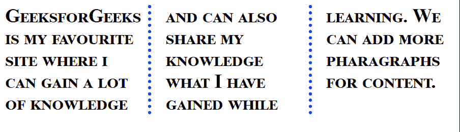

# 如何使用 CSS 在一个声明中设置所有字体属性？

> 原文:[https://www . geeksforgeeks . org/如何使用-css/](https://www.geeksforgeeks.org/how-to-set-all-the-font-properties-in-one-declaration-using-css/) 在一个声明中设置所有字体属性

在本文中，我们将学习如何使用 CSS 在一个声明中设置所有字体属性。这可用于快速设置所需的字体属性，而无需单独指定每个属性。

**方法:**我们将使用 CSS 的**字体**属性，这是所有字体属性的简写属性。这需要五个值:字体样式、字体变体、字体粗细、字体大小和字体系列。必须设置字体大小和字体系列属性，此属性才能工作。要使用的所有属性按以下顺序定义:

*   **[字体风格](https://www.geeksforgeeks.org/css-font-style-property/) :** 是字体的风格。
*   **[字体变体:](http://variant)** 设置字体是否以小写显示。
*   **[字体-权重:](https://www.geeksforgeeks.org/css-font-weight-property/)** 它设置字体的权重。
*   **[字号](https://www.geeksforgeeks.org/css-font-size-property/) :** 它设置字体的大小。
*   **[字体-家族:](https://www.geeksforgeeks.org/css-font-family-property/)** 它设置字体的家族。

**语法:**

```
font: font-style font-variant 
           font-weight font-size 
           font-family
```

**示例:**

## 超文本标记语言

```
<html>
<head>
  <style>
    body {
      /* font: font-weight font-variant 
               font-size font-style */
      font: bold small-caps 30px serif;
    }

    .gfg {
      column-count: 3;
      column-gap: 50px;
      column-rule: 5px dotted blue;
    }
  </style>
</head>
<body>
  <div class="parent">
    <div class="gfg">
      GeeksforGeeks is my favourite site where
      i can gain a lot of knowledge and can
      also share my knowledge what I have 
      gained while learning. We can add 
      more pharagraphs for content.
    </div>
  </div>
</body>
</html>
```

**输出:**

