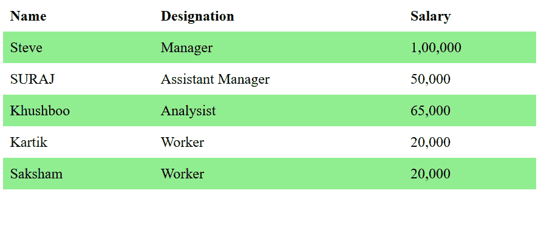
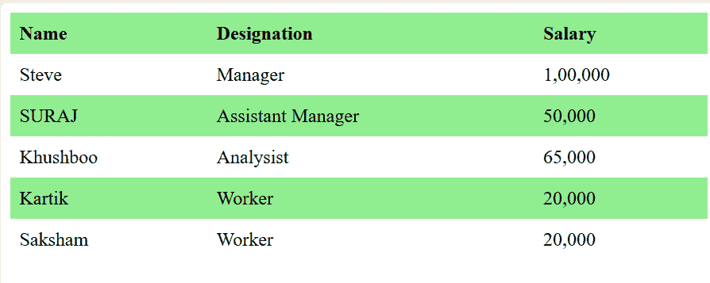

# 如何使用 CSS 设置交替表格行颜色？

> 原文:[https://www . geesforgeks . org/how-set-alternate-table-row-color-use-CSS/](https://www.geeksforgeeks.org/how-to-set-alternate-table-row-color-using-css/)

CSS 中的:n-child()选择器用于根据元素在一组同级元素中的位置来匹配元素。它匹配第 n 个子元素的每个元素。
**语法:**

```html
:nth-child(number) {
    // CSS Property
}
```

其中 number 是表示匹配元素模式的参数。它可以是奇数、偶数或函数符号。

*   **奇数:**表示一系列中位置为奇数的元素:1、3、5 等。
    **语法:**

```html
element:nth-child(even)
```

*   **偶:**表示位置在 2、4、6 等数列中偶的元素。
    **语法:**

```html
element:nth-child(odd)
```

**示例 1:** 它将颜色设置为在表格中交替偶数行。

## 超文本标记语言

```html
<!DOCTYPE html>
<html>

<head>

    <!-- CSS style to set alternate table 
            row using color -->
    <style>
        table {
            border-collapse: collapse;
            width: 100%;
        }

        th, td {
            text-align: left;
            padding: 8px;
        }

        tr:nth-child(even) {
            background-color: Lightgreen;
        }
    </style>
</head>

<body>
    <table>
        <tr>
            <th>Name</th>
            <th>Designation</th>
            <th>Salary</th>
        </tr>

        <tr>
            <td>Steve</td>
            <td>Manager</td>
            <td>1,00,000</td>
        </tr>

        <tr>
            <td>SURAJ</td>
            <td>Assistant Manager</td>
            <td>50,000</td>
        </tr>

        <tr>
            <td>Khushboo</td>
            <td>Analysist</td>
            <td>65,000</td>
        </tr>

        <tr>
            <td>Kartik</td>
            <td>Worker</td>
            <td>20,000</td>
        </tr>

        <tr>
            <td>Saksham</td>
            <td>Worker</td>
            <td>20,000</td>
        </tr>
    </table>
</body>

</html>
```

**输出:**



**例 2:** 设置表格中奇数行交替的颜色。

## 超文本标记语言

```html
<!DOCTYPE html>
<html>

<head>
    <title>
        Set alternate row in table
    </title>

    <style>
        table {
            border-collapse: collapse;
            width: 100%;
        }

        th, td {
            text-align: left;
            padding: 8px;
        }

        tr:nth-child(odd) {
            background-color: Lightgreen;
        }
    </style>
</head>

<body>
    <table>
        <tr>
            <th>Name</th>
            <th>Designation</th>
            <th>Salary</th>
        </tr>

        <tr>
            <td>Steve</td>
            <td>Manager</td>
            <td>1, 00, 000</td>
        </tr>

        <tr>
            <td>SURAJ</td>
            <td>Assistant Manager</td>
            <td>50, 000</td>
        </tr>

        <tr>
            <td>Khushboo</td>
            <td>Analysist</td>
            <td>65, 000</td>
        </tr>

        <tr>
            <td>Kartik</td>
            <td>Worker</td>
            <td>20, 000</td>
        </tr>

        <tr>
            <td>Saksham</td>
            <td>Worker</td>
            <td>20, 000</td>
        </tr>
    </table>
</body>    

<html>
```

**输出:**



**支持的浏览器:**

*   谷歌 Chrome 4.0
*   Internet Explorer 9.0
*   Firefox 3.5
*   歌剧 9.6
*   Safari 3.2

CSS 是网页的基础，通过设计网站和网络应用程序用于网页开发。你可以通过以下 [CSS 教程](https://www.geeksforgeeks.org/css-tutorials/)和 [CSS 示例](https://www.geeksforgeeks.org/css-examples/)从头开始学习 CSS。