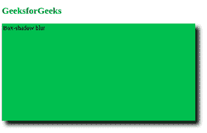

# 如何在 CSS 中设置模糊距离？

> 原文:[https://www . geeksforgeeks . org/如何在 css 中设置模糊距离/](https://www.geeksforgeeks.org/how-to-set-blur-distance-in-css/)

模糊距离意味着模糊元素的边界，并使用 CSS 设置其距离。在本文中，我们将看到如何使用 CSS 设置模糊距离，以便在 HTML 元素上设置模糊距离的样式。

您可以使用 [**框阴影**](https://www.geeksforgeeks.org/css-box-shadow-property/) **属性**，该属性为元素的帧赋予类似阴影的效果。

**语法:**

```css
box-shadow: h-offset v-offset blur color;
```

属性值:

*   **h-偏移量:**水平阴影值。
*   **v-偏移量:**垂直阴影值。
*   **模糊:**模糊阴影。

**示例 1:** 在本例中，我们将在 div 元素上添加模糊距离效果。

## 超文本标记语言

```css
<!DOCTYPE html>
<html>

<head>
    <style>
        h2 {
            color: green;
        }

        div {
            width: 500px;
            height: 250px;
            border: 3px solid #4CAF50;
            background-color: #4CAF50;
            position: center;
            box-shadow: 10px 10px 10px black;
        }

        div:hover {
            background-color: #3e8e41
        }
    </style>
</head>

<body>
    <h2>GeeksforGeeks</h2>
    <div>Box-shadow blur</div>
</body>

</html>
```

**输出:**



**示例 2:** 在本例中，我们将向两个不同的 div 元素添加蓝色距离属性。

## 超文本标记语言

```css
<!DOCTYPE html>
<html>

<head>
    <style>
        .gfg1 {
            border: 1px solid;
            padding: 10px;

            /* box-shadow: h-offset
                    v-offset blur spread */
            box-shadow: 5px 10px 10px 10px;
        }

        .gfg2 {
            border: 1px solid;
            padding: 10px;

            /* box-shadow: h-offset
                    v-offset blur spread */
            box-shadow: 5px 10px 28px 20px;
        }
    </style>
</head>

<body>
    <div class="gfg1">
        <h1>Welcome to GeeksforGeeks!</h1>
    </div><br><br>

    <div class="gfg2">
        A computer Science portal
    </div>
</body>

</html>
```

**输出:**

