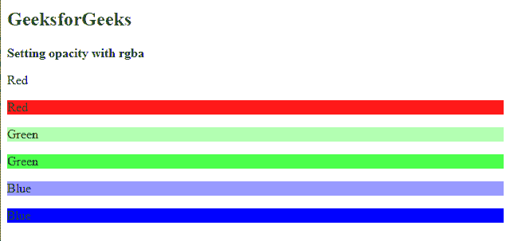

# 如何在 CSS 中用 RGBA 设置颜色不透明度？

> 原文:[https://www . geesforgeks . org/如何设置颜色-不透明度-带-rgba-in-css/](https://www.geeksforgeeks.org/how-to-set-color-opacity-with-rgba-in-css/)

在本文中，我们将看到如何在 CSS 中使用 RGBA 设置颜色不透明度。 [RGBA](https://www.geeksforgeeks.org/css-rgba-function/) 是一种颜色格式，基本上分别包含红、绿、蓝的值，RGBA 的‘A’代表 Alpha。为了设置颜色的不透明度，我们主要改变阿尔法值。alpha 的值从 0.0(完全透明)到 1.0(完全不透明)不等。

**语法:**

```css
class/id { attribute: rgba(val1, val2, val3, val4) }
```

**示例:**在下面的示例中，我们使用了带有 alpha 值(不透明度)的 CSS [*背景色*](https://www.geeksforgeeks.org/css-background-color-property/) 属性。

## 超文本标记语言

```css
<!DOCTYPE html>
<html>

<body>
    <h2 style="color:green">
        GeeksforGeeks
    </h2>
    <b>Setting opacity with rgba</b>

    <p class="para1" style=
        "background-color: rgba(255, 0, 0, 0.0);">
        Red
    </p>

    <p class="para2" style=
        "background-color:rgba(255, 0, 0, 0.9) ;">
        Red
    </p>

    <p class="para3" style=
        "background-color:  rgba(0, 255, 0, 0.3);">
        Green
    </p>

    <p class="para4" style=
        "background-color:  rgba(0, 255, 0, 0.7) ;">
        Green
    </p>

    <p class="para5" style=
        "background-color:rgba(0, 0, 255, 0.4) ;">
        Blue
    </p>

    <p class="para6" style=
        "background-color: rgba(0, 0, 255, 1.0);">
        Blue
    </p>

</body>

</html>
```

**输出:**我们可以看到不同的 alpha 值代表了不同的透明度。



RGBA 吗