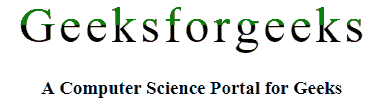
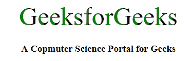

# 如何将 CSS 样式设置为半个字符？

> 原文:[https://www . geesforgeks . org/如何将 css 样式设置为半个字符/](https://www.geeksforgeeks.org/how-to-set-css-style-to-half-of-a-character/)

CSS 样式可以设置为垂直一半或水平一半的字符。在文本上添加一个类，该类包含应用一半字符的 CSS 样式。主要文本的可访问性由屏幕阅读器为盲人或视障人士保留。

您需要执行以下操作来将 CSS 应用于半个字符:

*   给半个字符或字母加样式的过程。
*   用 CSS/JavaScript 为字符的一部分设置样式的过程。
*   将 CSS 应用于 50%字符的过程
*   你只需要申请这门课。半样式化到每个元素，包含您想要半样式化的字符。

有两种流行的方式来塑造角色的一半。

*   使用 HTML 和 CSS
*   使用 HTM、CSS 和 jQuery

**示例 1:** 本示例使用 HTML 和 CSS 为半个字符设置样式。

```
<!DOCTYPE html>
<html>

<head>
    <title>Half Styled Character</title>
    <style type="text/css">
        .halfStyled {
            position: relative;
            font-size: 50px;
            display: inline-block;
            color: black;
            white-space: pre;
            overflow: hidden;
        }

        .halfStyled:before {
            display: block;
            position: absolute;
            z-index: 1;
            top: 0;
            left: 0;
            content: attr(data-content);
            height: 50%;
            overflow: hidden;
            color: green;
        }
    </style>
</head>

<body>
    <center>
        <span class="halfStyled" data-content="G">G</span>
        <span class="halfStyled" data-content="e">e</span>
        <span class="halfStyled" data-content="e">e</span>
        <span class="halfStyled" data-content="k">k</span>
        <span class="halfStyled" data-content="s">s</span>
        <span class="halfStyled" data-content="f">f</span>
        <span class="halfStyled" data-content="o">o</span>
        <span class="halfStyled" data-content="r">r</span>
        <span class="halfStyled" data-content="g">g</span>
        <span class="halfStyled" data-content="e">e</span>
        <span class="halfStyled" data-content="e">e</span>
        <span class="halfStyled" data-content="k">k</span>
        <span class="halfStyled" data-content="s">s</span>
        <h3>A Computer Science Portal for Geeks</h3>
    </center>
</body>

</html>
```

**输出:**


**示例 2:** 本示例使用 HTML、CSS 和 jQuery 来样式化半个字符。

```
<!DOCTYPE html>
<html>

<head>
    <title>Half Styling Character</title>

    <script src=
"https://ajax.googleapis.com/ajax/libs/jquery/1.11.1/jquery.min.js">
    </script>

    <style type="text/css">
        .halfStyled {
            position: relative;
            display: inline-block;
            font-size: 80px;
            color: black; 
            overflow: hidden;
            white-space: pre; 
        }

        .halfStyled:before {
            display: block;
            z-index: 1;
            position: absolute;
            top: 0;
            left: 0;
            width: 50%;
            content: attr(data-content); 
            overflow: hidden;
            color: green;
        }
        body {
            text-align: center;
        }
    </style>
</head>

<body>
    <span class="geeks">GeeksforGeeks</span>

    <h3>A Computer Science Portal for Geeks</h3>

    <script type="text/javascript">
        jQuery(function($) {
            var text, chars, $el, i, output;

            // Iterate over all class occurences
            $('.geeks').each(function(idx, el) {
                $el = $(el);
                text = $el.text();
                chars = text.split('');

                // Set the screen-reader text
                $el.html('<span style="position: absolute !important;'+
                        'clip: rect(1px 1px 1px 1px);' +
                        'clip: rect(1px, 1px, 1px, 1px);">'
                        + text + '</span>');

                // Reset output for appending
                output = '';

                // Iterate over all chars in the text
                for (i = 0; i < chars.length; i++) {

                    // Create a styled element for each character
                    // and append to container
                    output += '<span aria-hidden="true" class="halfStyled"'
                            + 'data-content="' + chars[i] + '">' 
                            + chars[i] + '</span>';
                }

                // Write to DOM only once
                $el.append(output);
            });
        });
    </script>
</body>

</html>
```

**输出:**
