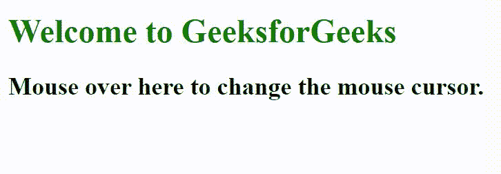
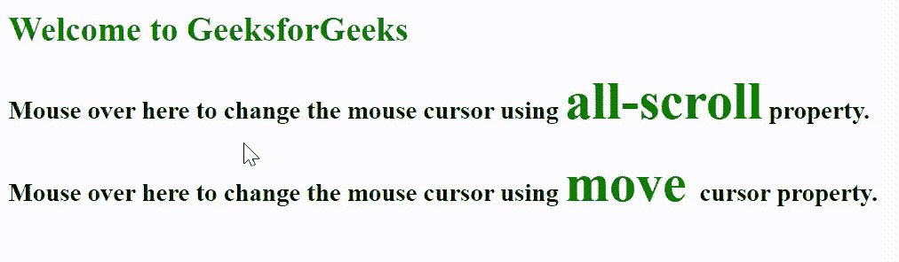

# 如何使用 CSS 设置指示任意方向滚动的光标样式？

> 原文:[https://www . geesforgeks . org/how-set-cursor-style-指示任意方向-滚动-使用-css/](https://www.geeksforgeeks.org/how-to-set-cursor-style-that-indicates-any-direction-scroll-using-css/)

在本文中，我们将看到如何使用 CSS 为任何方向设置光标样式。使用 [**全滚动**](https://www.geeksforgeeks.org/css-cursor-property/) 光标属性可以创建该样式。此属性设置光标，指示使用 CSS 滚动的任何方向。**全滚动**属性值表示某物可以向任何方向滚动。

**语法:**

```
cursor: all-scroll;
```

**例 1:**

## 超文本标记语言

```
<!DOCTYPE html>
<html>

<head>
    <style>
        #all-scroll {
            cursor: all-scroll;
        }
    </style>
</head>

<body>
    <h1 style="color: green">
        Welcome to GeeksforGeeks
    </h1>

    <h2 style="font-family: Impact" id="all-scroll">
        Mouse over here to change the
        mouse cursor.
    </h2>
</body>

</html>
```

**输出:**



**例 2:** 我们可以使用**移动**属性值来设置光标样式。

## 超文本标记语言

```
<!DOCTYPE html>
<html>

<head>
    <style>
        .gfg {
            color: green;
            font-size: 50px;
        }

        #all-scroll {
            cursor: all-scroll;
        }

        #move {
            cursor: move;
        }
    </style>
</head>

<body>
    <h1 style="color: green">
        Welcome to GeeksforGeeks
    </h1>

    <h2 id="all-scroll">
        Mouse over here to change the
        mouse cursor using <small class="gfg">
            all-scroll</small> property.
    </h2>

    <h2 id="move">
        Mouse over here to change the mouse
        cursor using <small class="gfg">move
        </small> cursor property.
    </h2>
</body>

</html>
```

**输出:**



**支持的浏览器:**

*   谷歌 Chrome
*   边缘
*   Mozilla Firefox
*   歌剧
*   旅行队