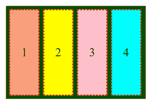

# 如何设置默认值来对齐 CSS 中的内容？

> 原文:[https://www . geesforgeks . org/如何设置默认值以对齐 css 中的内容/](https://www.geeksforgeeks.org/how-to-set-default-value-to-align-content-in-css/)

在本文中，我们将学习如何设置默认值，以便在 CSS 中将内容与其默认值对齐。align-content 属性用于对齐指定容器内的内容。

**方法:****对齐内容属性**的**正常**值用于设置 CSS 中的默认值。根据 flexbox 规范，它将其默认值设置为**初始**，即**拉伸**对齐内容属性。

**语法:**

```html
align-content: normal;
```

下面的例子演示了上述方法。

**示例:**如果对齐内容属性的默认值设置为**正常**值。

## 超文本标记语言

```html
<!DOCTYPE html>
<html>

<head>
    <style>
      .box{
        width: 36vw;
        height: 50vh;
        border: 2px solid black;
        display: flex;
        flex-wrap: wrap;
        background-color: darkgreen;

      /*default value*/
        align-content: normal ;
      }
      #item1, #item2 , #item3 ,
      #item4 {
        box-sizing: border-box;
        min-height: 20%;
        width: 22%;
        border: 1.5px dashed red;
        margin: 0.5vw;
        display: flex;
        align-items: center;
        justify-content: center;
      }
      #item1{
        background-color: lightsalmon;
      }
      #item2{
        background-color: yellow;
      }
      #item3{
        background-color: pink;
      }
      #item4{
        background-color: cyan;
      }

  </style>
</head>

<body>
  <div class="box">
    <div id="item1">1</div>
    <div id="item2">2</div>
    <div id="item3">3</div>
    <div id="item4">4</div>
  </div>
</body>

</html>
```

**输出:**盒子里面的四个项目全部对齐**正常**值，也就是 CSS flexbox 中的**拉伸**。



**支持的浏览器:**

*   谷歌 Chrome 21.0
*   Internet Explorer 11.0
*   Firefox 28.0
*   歌剧 12.1
*   Safari 9.0