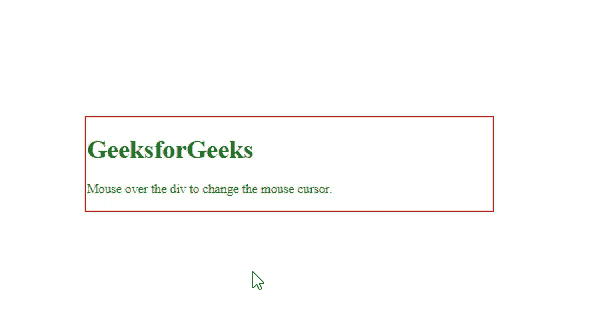
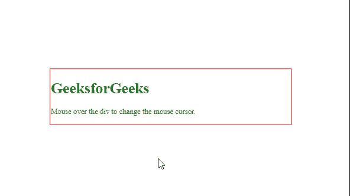

# 如何使用 CSS 设置不同类型的光标？

> 原文:[https://www . geesforgeks . org/如何使用-css 设置不同类型的光标/](https://www.geeksforgeeks.org/how-to-set-different-type-of-cursors-using-css/)

在本文中，我们将学习如何使用 CSS 设置不同类型的游标。[光标属性](https://www.geeksforgeeks.org/css-cursor-property/)用于使用 CSS 设置不同类型的光标。在 cursor 属性的帮助下，我们可以指定鼠标指针指向一个元素时要显示的内容。它接受一个游标类型的值。

**语法:**

```css
cursor: value
```

**例 1:**

## 超文本标记语言

```css
<!DOCTYPE html>
<html>
<head>
    <style>
        div{
            color: green;
            cursor: all-scroll;
            border: solid 2px red;
            margin: 10% 30%;
            width: 30%;
        }
    </style>
</head>

<body>
    <div class="gfg">
        <h1>GeeksforGeeks</h1>
        <p>
            Mouse over the div to change 
            the mouse cursor.
        </p>

    </div>
</body>

</html>
```

**输出:**



**例 2:**

## 超文本标记语言

```css
<!DOCTYPE html>
<html>

<head>
    <style>
        div{
            color: green;
            cursor: zoom-in;
            border: solid 2px red;
            margin: 10% 30%;
            width: 30%;
        }
    </style>
</head>

<body>
    <div class="gfg">
        <h1>GeeksforGeeks</h1>
        <p>
            Mouse over the div to change 
            the mouse cursor.
        </p>

    </div>
</body>

</html>
```

**输出:**

