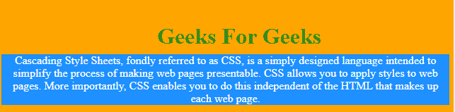
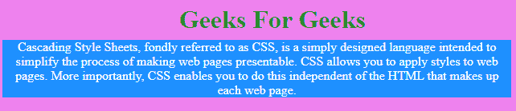
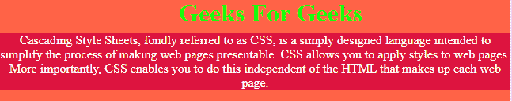

# 如何使用 CSS 设置 div 宽度以适合内容？

> 原文:[https://www . geesforgeks . org/how-set-div-width-fit-content-use-CSS/](https://www.geeksforgeeks.org/how-to-set-div-width-to-fit-content-using-css/)

下面列出了解决这个问题的三种方法:

1.  [默认情况下](#no_1)
2.  [使用内嵌块属性](#no_2)
3.  [在宽度和高度上使用适合度属性](#no_3)

**默认情况下:**默认情况下，HTML div 适合其中的内容。示例如下:
**示例 1:**

```css
<!DOCTYPE html>
<html lang = "en" dir = "ltr">

<head>
    <meta charset = "utf-8">
    <title>GeeksforGeeks Example</title>

    <!--CSS Code-->
    <style media = "screen">
        body {
            background: orange;
            overflow: hidden;
            color: white;
        }
        .GeeksForGeeks {
            text-align: center;
            background: dodgerblue;
            position: absolute;
            top: 50%;
            left: 1%;
            right: 1%;
        }
    </style>
</head>

<body>

    <!-- HTML Code -->
    <h1 style = "color:forestgreen; top:35%;
            left: 35%; position:absolute; ">
        Geeks For Geeks
    </h1>

    <div class = "GeeksForGeeks">
        Cascading Style Sheets, fondly referred
        to as CSS, is a simply designed language
        intended to simplify the process of
        making web pages presentable. CSS allows
        you to apply styles to web pages. More
        importantly, CSS enables you to do this
        independent of the HTML that makes up
        each web page.
    </div>
</body>

</html>
```

**输出:**


**使用内联块属性:**使用显示:内联块属性根据其内容设置 div 大小。

**例 2:**

```css
<!DOCTYPE html>
<html lang = "en">

<head>
    <meta charset = "utf-8">

    <title>GeeksforGeeks Example</title>

    <!--CSS Code-->
    <style media = "screen">
        body {
            background: violet;
            overflow: auto;
            color: white;
        }
        .GeeksForGeeks {
            text-align: center;
            background: dodgerblue;
            position: absolute;
            display: inline-block;
            left: 1%;
            right: 1%;
            top: 50%;
        }
    </style>
</head>

<body>
    <!-- HTML Code -->
    <h1 style="color: forestgreen; 
        top: 35%; left: 35%; position: absolute;">
        Geeks For Geeks
    </h1>

    <div class="GeeksForGeeks">
        Cascading Style Sheets, fondly referred
        to as CSS, is a simply designed language
        intended to simplify the process of
        making web pages presentable. CSS allows
        you to apply styles to web pages. More
        importantly, CSS enables you to do this
        independent of the HTML that makes up
        each web page.
    </div>
</body>

</html>
```

**输出:**


**在宽度和高度上使用拟合内容属性:**在该方法中，我们将宽度和高度属性设置为拟合内容值。
T3】例 3:

```css
<!DOCTYPE html>
<html lang = "en" dir = "ltr">

<head>
    <meta charset = "utf-8">
    <title>Geeks for Geeks Example</title>

    <!--CSS Code-->
    <style media = "screen">
        body {
            background: tomato;
            overflow: hidden;
            color: white;
        }
        .GeeksForGeeks {
            background: crimson;
            position: absolute;
            width:fit-content;
            height:fit-content;
            left: 0;
            top: 50%;
        }
    </style>
</head>

<body>
    <!-- HTML Code -->
    <h1 style = "color: lime; top: 35%;
        left: 35%; position: absolute;">
        Geeks For Geeks
    </h1>

    <div class = "GeeksForGeeks">
        Cascading Style Sheets, fondly referred
        to as CSS, is a simply designed language
        intended to simplify the process of 
        making web pages presentable. CSS allows
        you to apply styles to web pages. More
        importantly, CSS enables you to do this
        independent of the HTML that makes up
        each web page.
    </div>
</body>

</html>
```

**输出:**
