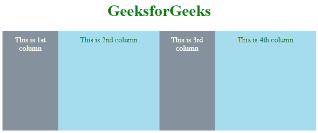
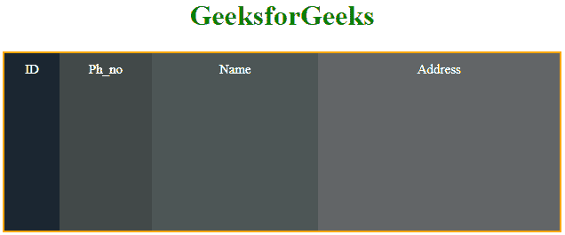

# 如何用 CSS 设置元素宽度不等的 flexbox？

> 原文:[https://www . geeksforgeeks . org/如何使用 css 设置元素宽度不等的 flexbox/](https://www.geeksforgeeks.org/how-to-set-flexbox-having-unequal-width-of-elements-using-css/)

CSS 中的**伸缩属性**是*伸缩-增长*、*伸缩*和*伸缩-基础属性*的组合。用于设置柔性物品的长度。flex 属性响应速度快，移动友好。很容易定位子元素和主容器。
页边距不会随着内容页边距而塌陷。无需编辑 HTML 部分，任何元素的顺序都可以轻松更改。但是很少有时候我们有一个不等宽的元素，那时候你可以在 CSS 部分设计所有的东西。

**语法:**

```
flex: number;
```

**注意:**在这种情况下，元素宽度取决于窗口的其他元素和屏幕。

**例 1:** 这里你会看到两种类型的宽度 flexbox 都是用 CSS 设计的。

```
<!DOCTYPE html>
<html>
    <head>
        <title>Unequal width of Element | Flexbox</title>
        <style>
            h1{
                color:green;
            }
            div.flexcontainer{
                display: flex;
                min-height: 200px; 
                font-size:15px;
            }

            div.columns{
                flex: 1;
                padding: 10px;

            }
            div.columns:nth-of-type(even){
                flex: 2;

            }

            div.columns:nth-of-type(odd){
                background: #85929E;
                color: white;
            }
            div.columns:nth-of-type(even){
                background: #A5DDEF;
                color: green;
            }
        </style>
    </head>
    <body>
        <center>
            <h1>GeeksforGeeks</h1>
    <div class="flexcontainer">

        <div class="columns">This is 1st column</div>
        <div class="columns">This is 2nd column</div>
        <div class="columns">This is 3rd column</div>
        <div class="columns">This is 4th column</div>

    </div>
    </body>
</html>                    
```

**输出:**


**示例 2:** 在此示例中，您将看到 4 个项目，每个项目的宽度彼此不相等。

```
<!DOCTYPE html>
<html>
    <head>
        <title>Unequal width of Element | Flexbox</title>
        <style>
            h1{
                color:green;
            }
            div.flexcontainer{
                display: flex;
                min-height: 200px; 
                font-size:15px;
                border:2px solid orange;
            }

            div.columns{
                padding: 10px;
                color:white;

            }
            div.columns:nth-of-type(1){
                flex: 0.5;
                background: #1B2631;
            }
            div.columns:nth-of-type(2){
                flex: 1;
                background:#424949;

            }
            div.columns:nth-of-type(3){
                flex: 2;
                background:#4D5656;

            }
            div.columns:nth-of-type(4){
                flex: 3;
                background:#626567;

            }
            th, td{
                border:1px solid white;
            }

        </style>
    </head>
    <body>
        <center>
            <h1>GeeksforGeeks</h1>
    <div class="flexcontainer">

        <div class="columns">ID</div>
        <div class="columns">Ph_no</div>
        <div class="columns">Name</div>
        <div class="columns">Adsress</div>

    </div>
    </body>
</html>                    
```

**输出:**
