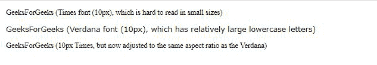

# 如何在 CSS 中设置字号-调整属性？

> 原文:[https://www . geeksforgeeks . org/如何设置字体大小-调整属性-in-css/](https://www.geeksforgeeks.org/how-to-set-font-size-adjust-property-in-css/)

本文的目的是使用 **CSS** 设置 **[字号-调整](https://www.geeksforgeeks.org/css-font-size-adjust-property/)** 属性。

**方法:****字号调整**属性设置小写字母相对于大写字母当前字号的大小。大写字母和小写字母之间的大小差异称为 ***长宽值*** 。在第一指定字体不可用的情况下，浏览器可能会选择第二指定字体，这可能会导致重大差异。 **font-size-adjust** 属性允许开发人员禁用或修改此行为，因为考虑到小屏幕而设计的网页不需要它。

**语法:**

```
font-size-adjust: number|none|initial|inherit;

```

**注意:**浏览器将忽略字体系列，根据字体大小调整属性的指定值设置长宽值。

**示例:**

## 超文本标记语言

```
<!DOCTYPE html>
<html>

<head>
    <style>
        #times {

            /*Default Times font*/
            font-family: Times, serif;
            font-size: 10px;
        }

        #verdana {

            /*Default Verdana Font used*/
            font-family: Verdana, sans-serif;
            font-size: 10px;
        }

        #adjustedtimes {

            /* Times Font adjusted to Verdana 
            Font Aspect Value*/
            font-family: Times, serif;
            font-size-adjust: 0.58;
            font-size: 10px;
        }
        /* font-size-adjust property is given 
        preference by the Browser over 
        font-family peoperty */
    </style>
</head>

<body>
    <p id="times">
        GeeksForGeeks (Times font (10px), which 
        is hard to read in small sizes)
    </p>

    <p id="verdana">
        GeeksForGeeks (Verdana font (10px), which 
        has relatively large lowercase letters)
    </p>

    <p id="adjustedtimes">
        GeeksForGeeks (10px Times, but now 
        adjusted to the same aspect ratio 
        as the Verdana)
    </p>
</body>

</html>
```

**输出:**

