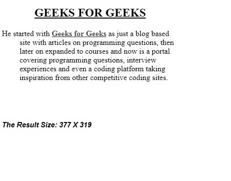
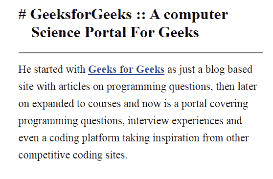

# 如何使用 CSS 设置段落第二行缩进？

> 原文:[https://www . geeksforgeeks . org/如何使用 css 设置段落的第二行缩进/](https://www.geeksforgeeks.org/how-to-set-indent-the-second-line-of-paragraph-using-css/)

有几种方法可以缩进段落的第二行，这可以通过多种方式实现。下面用适当的代码和输出描述了实现这一点的一些方法。现在，一些样式可以使用 CSS 以各种方式完成，根据需要缩进第二行。

**注意:**默认情况下，当行换行时，它们刚好在前一行开始的位置下方开始。看看下面的内容，看看这是如何实现的:

**语法:**

```html
/* length values */
text-indent: 3mm;
text-indent: 40px;

/* percentage value
relative to the containing block width */
text-indent: 15%;

/* Keyword values */
text-indent: 5em each-line;
text-indent: 5em hanging;
text-indent: 5em hanging each-line;

/* Global values */
text-indent: inherit;
text-indent: initial;
text-indent: unset;
```

<**方法 1:** 在本例中，文本的第一行不缩进，但第二行的后续行缩进，因此第一行不会移动。在本例中，这是通过将文本缩进设置为-36px 并将左填充值设置为 36px 来实现的。在本例中，开头的 div 标签包含以下样式信息作为属性。

**示例:**

```html
<!DOCTYPE html>
<html>

<head>
    <title>
        Set indent in second line of paragraph
    </title>

    <meta name="viewport" content=
        "width=device-width, initial-scale=1.0" />

    <style>
        h2 {
            text-align: center;
        }

        div.a {
            text-indent: -36px;
            padding-left: 36px;
        }
    </style>
</head>

<body>
    <h2><u>GEEKS FOR GEEKS</u></h2>

    <div class="a">
        <p>
            He started with <a href="https://www.geeksforgeeks.org/">
            <b>Geeks for Geeks</b></a> as just a blog based site with
            articles on programming questions, then later on expanded
            to courses and now is a portal covering programming
            questions, interview experiences and even a coding platform
            taking inspiration from other competitive coding sites.
        </p>
    </div>
</body>

</html>
```

**输出:**


**方法 2:** 通过相对于第一行进行定位，将文本缩进设置为-26px，左填充值设置为 26px。在这个例子中，我们已经确定了第二条线相对于第一条线的位置。所以第二行根据第一行缩进/对齐。

**示例:**

```html
<!DOCTYPE html>
<html>

<head>
    <title>
        Set indent in second line of paragraph
    </title>

    <meta name="viewport" content="width=device-width, 
        initial-scale=1.0" />

    <style>
        body {

            margin: 15px;
            font-family: Times New Roman;
        }

        #container {
            margin: 0 auto;
            max-width: 500px;
        }

        #container p {
            border-top: solid 3px #808080;
            margin: 0;
            padding-top: 15px;
            font-size: 1.4em;
            font-weight: 100;
            line-height: 1.6em;
        }

        #container h1 span {
            color: #008000;
        }

        #container h1 {
            text-indent: -26px;
            padding-left: 26px;
        }
    </style>
</head>

<body>
    <div id="container">
        <h1>
            <span>#</span>
            GeeksforGeeks :: A computer Science Portal For Geeks
        </h1>

        <p>He started with <a href="https://www.geeksforgeeks.org/">
            <b>Geeks for Geeks</b></a> as just a blog based site
            with articles on programming questions, then later
            on expanded to courses and now is a portal covering
            programming questions, interview experiences and even
            a coding platform taking inspiration from other
            competitive coding sites.
        </p>
    </div>
</body>

</html>
```

**输出:**
