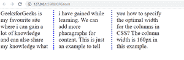

# 如何设置长度来设置 CSS 中各列之间的间距？

> 原文:[https://www . geeksforgeeks . org/如何设置长度来设置 css 中的列间距/](https://www.geeksforgeeks.org/how-to-set-length-to-set-the-gap-between-the-columns-in-css/)

在本文中，我们将学习如何设置长度，这将设置列之间的间隙。

**方法:****列间距**属性用于指定设置列间距的长度。它接受一个值来固定列之间的指定间距。

**语法:**

```html
column-gap: value;
```

**例 1:**

## 超文本标记语言

```html
<!DOCTYPE html>
<html lang="en">

<head>
    <style>
        .gfg {
            font-size: 30px;
            column-count: 3;
            column-gap: 50px;
        }
    </style>
</head>

<body>
    <div class="parent" style="width: 50%;">
        <div class="gfg">
            GeeksforGeeks is my favorite site where
            I can gain a lot of knowledge and can
            also share my knowledge what I have gained
            while learning. We can add more
            paragraphs for content. This is just an
            example to tell you how to specify
            the optimal width for the columns in CSS?
            The column width is 160px in this example.
        </div>
    </div>
</body>

</html>
```

**输出:**

**应用属性前:**


**应用属性后:**


**例 2:**

## 超文本标记语言

```html
<!DOCTYPE html>
<html lang="en">

<head>
    <style>
        .gfg {
            font-size: 30px;
            column-count: 3;
            column-gap: 50px;
            column-rule: 5px dotted blue;
        }
    </style>
</head>

<body>
    <div class="parent" style="width: 50%;">
        <div class="gfg">
            GeeksforGeeks is my favorite site where
            I can gain a lot of knowledge and can
            also share my knowledge what I have
            gained while learning. We can add more
            paragraphs for content. This is just an
            example to tell you how to specify
            the optimal width for the columns in CSS?
            The column width is 160px in this example.
        </div>
    </div>
</body>

</html>
```

**输出:**

**应用属性前:**



**应用属性后:**

