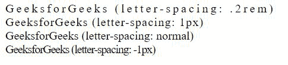

# 如何使用 CSS 设置字母间距？

> 原文:[https://www . geesforgeks . org/如何使用-css 设置字母间距/](https://www.geeksforgeeks.org/how-to-set-letter-spacing-using-css/)

在本文中，我们将看到如何使用 CSS 设置字母间距。

**方法:****[字母间距](https://www.geeksforgeeks.org/css-letter-spacing-property/)** CSS 属性用于设置文本字符之间的<u>水平间距</u>行为。呈现文本时，此值会添加到字符之间的自然间距中。正值有助于扩展文本，负值有助于收缩文本。

**语法:**

```css
/* Keyword value */
letter-spacing: normal;

/* <length> values */
letter-spacing: 0.3em;
letter-spacing: 3px;
letter-spacing: .3px;

/* Global values */
letter-spacing: inherit;
letter-spacing: initial;
letter-spacing: unset;
```

**示例:**

## 超文本标记语言

```css
<!DOCTYPE html>
<html>

<head>
    <style>
        .div1 {
            letter-spacing: .2rem;
        }

        .div2 {
            letter-spacing: 1px;
        }

        .div3 {
            letter-spacing: normal;
        }

        .div4 {
            letter-spacing: -1px;
        }
    </style>
</head>

<body>
    <div class="div1">
        GeeksforGeeks (letter-spacing: .2rem)
    </div>
    <div class="div2">
        GeeksforGeeks (letter-spacing: 1px)
    </div>
    <div class="div3">
        GeeksforGeeks (letter-spacing: normal)
    </div>
    <div class="div4">
        GeeksforGeeks (letter-spacing: -1px)
    </div>
</body>

</html>
```

**输出:**



**注意:**这个属性有一些限制-

*   此属性不能使用百分比单位。
*   此属性不能与对齐文本一起使用。