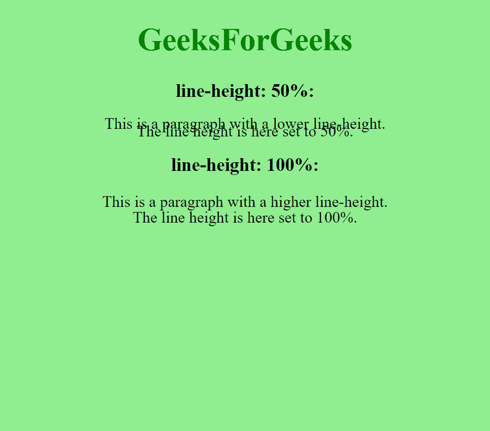
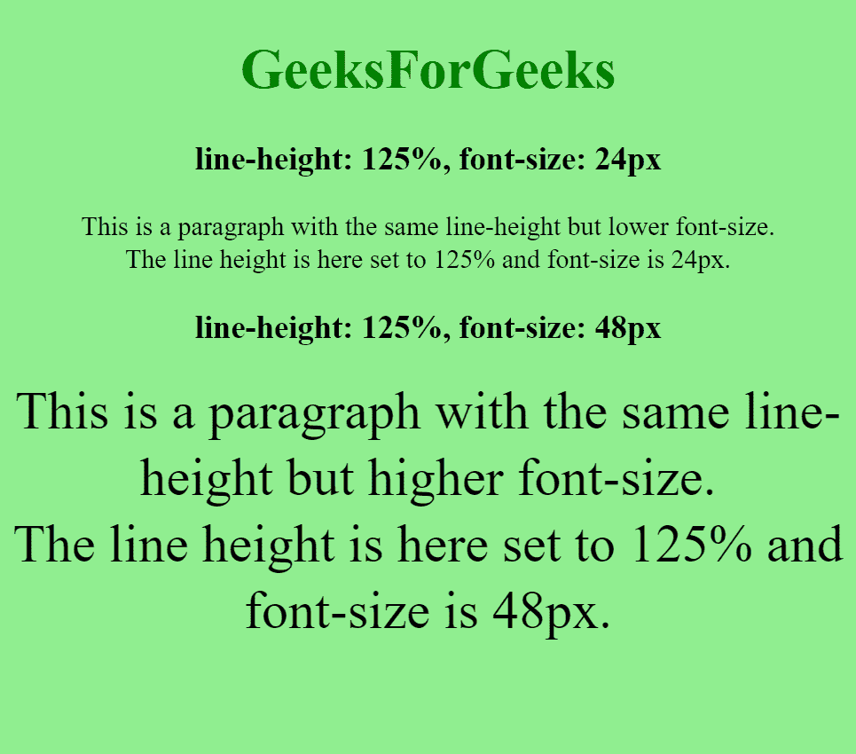

# 如何使用 CSS 设置行高百分比？

> 原文:[https://www . geesforgeks . org/如何使用 css 设置线高百分比/](https://www.geeksforgeeks.org/how-to-set-line-height-in-percent-using-css/)

在本文中，我们将学习如何使用 CSS 设置线条高度的百分比。行高是 CSS 的一个属性，用于在每个元素后提供高度。

**方法:**我们将在 CSS 中使用*行高*属性，并使用百分比设置该值。百分比设置相对于元素字体大小的行高。通过将元素的计算字体大小乘以给定的百分比值来确定设置的最终值。

**语法:**

```html
line-height: percent
```

**例 1:** 在本例中，使用了不同的行高百分比值，字体大小相同。

## 超文本标记语言

```html
<!DOCTYPE html>
<html>

<head>
    <style>
        body {
            text-align: center;
            font-size: 25px;
            background-color: lightgreen;
        }

        div.a {
            line-height: 50%;
        }

        div.b {
            line-height: 100%;
        }
    </style>
</head>

<body>

    <h1 style="color:green">
        GeeksForGeeks
    </h1>

    <h3>line-height: 50%:</h3>
    <div class="a">
        This is a paragraph with a
        lower line-height.<br>
        The line height is here set to 50%.
    </div>

    <h3>line-height: 100%:</h3>
    <div class="b">
        This is a paragraph with a
        higher line-height.<br>The 
        line height is here set to 100%.
    </div>
</body>

</html>
```

**输出:**



**示例 2:** 在本示例中，相同的行高百分比值用于不同的字体大小。

## 超文本标记语言

```html
<!DOCTYPE html>
<html>

<head>
    <style>
        body {
            text-align: center;
            font-size: 25px;
            background-color: lightgreen;
        }

        div.a {
            font-size: 24px;
            line-height: 125%;
        }

        div.b {
            font-size: 48px;
            line-height: 125%;
        }
    </style>
</head>

<body>

    <h1 style="color:green">
        GeeksForGeeks
    </h1>

    <h3>
        line-height: 125%,
        font-size: 24px
    </h3>
    <div class="a">
        This is a paragraph with the same 
        line-height but lower font-size.
        <br>The line height is here set 
        to 125% and font-size is 24px.
    </div>

    <h3>line-height: 125%,
        font-size: 48px</h3>
    <div class="b">
        This is a paragraph with the same 
        line-height but higher font-size.
        <br>The line height is here set to 
        125% and font-size is 48px.
    </div>
</body>

</html>
```

**输出:**

