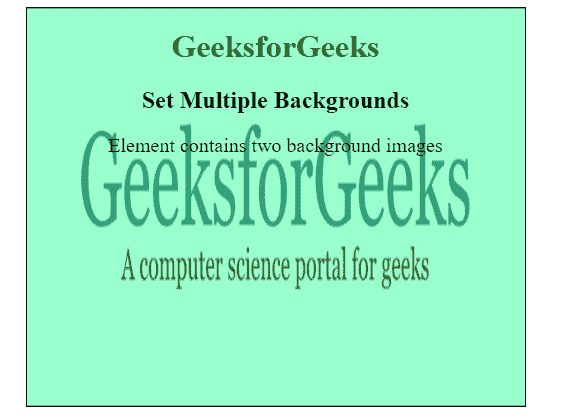

# 如何使用 CSS 设置多个背景图像？

> 原文:[https://www . geesforgeks . org/how-set-multi-background-images-use-CSS/](https://www.geeksforgeeks.org/how-to-set-multiple-background-images-using-css/)

一个元素的多个背景图像可以用 CSS 放在 HTML 页面中。使用 CSS 背景属性为任何模式中的元素添加多个背景图像，并使用其他 CSS 属性设置图像的高度和宽度。

下面列出了使用的背景属性:

*   **背景-图片:url()，url()，…；**此属性用于为元素设置一个或多个背景图像，用逗号分隔。
*   **背景-位置:右下，左上；**此属性用于设置页面中不同图像的位置。它为每个背景图像设置初始位置。
*   **背景-重复:不-重复，重复；**该属性用于设置背景图像的重复。背景图像可以沿着水平轴和垂直轴重复。
*   **背景-尺寸:封面|内含| 30% | 200 px 100 px；**该属性用于设置元素背景图像的大小。

**示例 1:** 使用单个背景属性指定多个背景图像。

```html
<!DOCTYPE html>
<html>

<head>
    <style> 
        body { 
            text-align:center;
        }
        h1 { 
            color: green; 
        } 
        #GFG {
            background-image: 
url(https://media.geeksforgeeks.org/wp-content/uploads/geeksforgeeks-6-1.png), 
url(https://media.geeksforgeeks.org/wp-content/uploads/backgroundimage-1.png);

            background-position: center, center;
            background-repeat: no-repeat, no-repeat;
            background-size: 400px 200px, 500px 400px;
            padding:25px;
            height:400px;
        }
    </style>
</head>

<body> 
    <div id = "GFG">

        <h1>GeeksforGeeks</h1>

        <h2>Set Multiple Backgrounds</h2>

        <p>
            Element contains two background images
        </p>
    </div>
</body>

</html>                                
```

**输出:**


**示例 2:** 使用背景速记属性指定多个背景图像。

```html
<!DOCTYPE html>
<html>

<head>
    <style> 
        h1 { 
            color: green; 
        } 
        body { 
            text-align: center; 
        } 
        #GFG {
            background: 
url(https://media.geeksforgeeks.org/wp-content/uploads/geeksforgeeks-6-1.png)
            center no-repeat, 
url(https://media.geeksforgeeks.org/wp-content/uploads/backgroundimage-1.png) 
            center no-repeat;

            background-size:400px 200px, 400px 400px;
            padding:25px;
            height:400px;
        }
    </style>
</head>

<body> 
    <div id = "GFG">

        <h1>GeeksforGeeks</h1>

        <h2>Set Multiple Backgrounds</h2>

        <p>
            Element contains two background images
        </p>
    </div>
</body>

</html>                    
```

**输出:**
