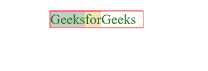

# 如何在 CSS 中设置分割元素内部的柔性项的顺序？

> 原文:[https://www . geeksforgeeks . org/如何在 css 中设置分部内部项目的灵活顺序/](https://www.geeksforgeeks.org/how-to-set-order-of-the-flexible-items-inside-the-division-element-in-css/)

CSS 中的 order 属性用于指定容器内灵活项的顺序。因此，为了设置分割元素中灵活项目的顺序，我们使用[顺序属性](https://www.geeksforgeeks.org/css-ordering-flex-items/)并设置 CSS 中项目的顺序。在本文中，我们将学习如何在 CSS 中设置分割元素内部的灵活项的顺序。

**语法:**

```css
order: value;
```

**示例:**

## 超文本标记语言

```css
<!DOCTYPE html>
<html>
<head>
    <title></title>
    <style>
        center{
            margin: 50px;
            color:green;
            font-size: 60px;
        }
        .parent{
            display: flex;
            border: solid 3px red;
            width: 400px;
        }
        .gfg1{   
            order: 2;
            background-color: wheat;
        } 
        .gfg2{
            order: 1;
            background-color: rgb(197, 197, 197);
        }
        .gfg3{
            order: 3;
            background-color:azure;
        }
    </style>
</head>
<body>
    <center>
        <div class="parent">
            <div class="gfg1">for</div>
            <div class="gfg2">Geeks</div>
            <div class="gfg3">Geeks</div>
        </div>
    </center>
</body>
</html>
```

**输出:**

*   在应用订单属性之前:

    

*   应用订单属性后:

    