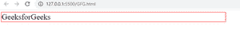
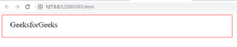
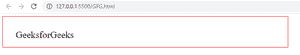

# 如何用 CSS 设置元素周围的填充？

> 原文:[https://www . geeksforgeeks . org/如何使用-css/](https://www.geeksforgeeks.org/how-to-set-padding-around-an-element-using-css/) 在元素周围设置填充

在本文中，我们将学习如何使用 CSS 设置元素周围的填充。

**方法:**[填充](https://www.geeksforgeeks.org/css-margins-padding/)是元素内容与其边界之间的空间。我们可以使用 CSS 的 padding 属性来设置元素周围的填充。它有四个值 top_padding、right_padding、bottom_padding 和 left_padding。

**语法:**

```css
padding: top_padding right_padding bottom_padding left_padding;
```

我们还可以将这些值单独用作一次取一个值的属性。

**语法:**

```css
padding-top: value;
padding-right: value;
padding-left: value;
padding-bottom: value;
```

**例 1:**

## 超文本标记语言

```css
<!DOCTYPE html>
<html lang="en">
<head>
    <style>
        .gfg1{
            width: 50%;
            font-size: 30px;
            border: solid 2px red;
            padding: 20px 20px 30px 30px;
        }
    </style>
</head>
<body>
    <div class="gfg1">GeeksforGeeks</div>
</body>
</html>
```

**输出:**

*   在应用填充属性之前:



*   应用填充属性后:



**例 2:**

## 超文本标记语言

```css
<!DOCTYPE html>
<html lang="en">
<head>
    <style>
        .gfg1{
            width: 50%;
            font-size: 30px;
            border: solid 2px red;
            padding-top: 40px;
            padding-left: 40px;
            padding-bottom: 20px;
            padding-right: 20px;
        }
    </style>
</head>
<body>
    <div class="gfg1">GeeksforGeeks</div>
</body>
</html>
```

**输出:**

*   在应用填充属性之前:


*   应用填充属性后:

