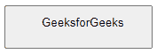
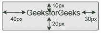

# 如何用 CSS 设置元素内部的填充？

> 原文:[https://www . geeksforgeeks . org/如何使用-css 设置元素内填充/](https://www.geeksforgeeks.org/how-to-set-padding-inside-an-element-using-css/)

在本文中，我们将看到如何使用 CSS 在元素中设置填充。填充被认为是内容与其边框之间的空间。填充在定义的边框内创建空间。填充和边距的区别在于，边距在边框外创建空间，而填充在边框内为内容创建空间(边框只是分配了区域的任何标签)。

我们可以使用下面的属性来设置元素内部的填充。

*   [CSS 填充-底部属性](https://www.geeksforgeeks.org/css-padding-bottom-property/)
*   [CSS 填充-顶部属性](https://www.geeksforgeeks.org/css-padding-top-property/)
*   [CSS 填充-右侧属性](https://www.geeksforgeeks.org/css-padding-right-property/)
*   [CSS 填充-左侧属性](https://www.geeksforgeeks.org/css-padding-left-property/)

**语法:**

```
/* Set padding to all sides
   padding: numberpx;

/* Set padding to specific side
   padding-top: numberpx;
   padding-right: numberpx;
   padding-left: numberpx;
   padding-bottom: numberpx;
```

**方法:**我们将使用 CSS 中的 padding 属性创建一个按钮标签，该标签的各个边都有 padding 设置。下面是说明填充使用的代码。

**示例:**

## 超文本标记语言

```
<!DOCTYPE html>
<html lang="en">

<head>
  <style>
    button{
      padding-top: 10px;
      padding-bottom: 20px;
      padding-right: 30px;
      padding-left: 40px;
    }
</style>
</head>

<body>
    <button>
      GeeksforGeeks
    </button>
</body>

</html>
```

**输出:**



**说明:**这里我们创建了一个按钮，然后使用 CSS 从每一侧不同地更改其填充属性。

