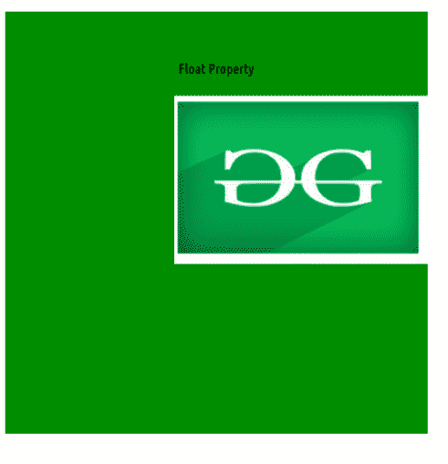

# 如何在 CSS 中设置图像的位置？

> 原文:[https://www . geesforgeks . org/如何设置 css 中图像的位置/](https://www.geeksforgeeks.org/how-to-set-position-of-an-image-in-css/)

您可以使用[对象位置属性](https://www.geeksforgeeks.org/css-object-position-property/)轻松定位图像。您也可以使用一系列其他方式，如[浮动属性](https://www.geeksforgeeks.org/what-is-float-property-in-css/)，这将在本文中进一步讨论。

**方法:**

*   **对象位置属性:**指定图像元素如何在其内容框内用 x，y 坐标定位。
*   **浮动属性:**指定元素应该如何浮动，并将元素放置在其容器的右侧或左侧。

**方法 1:使用*物体位置*属性**

**语法:**

```css
object-position: <position>
```

**属性值:**

*   **位置:**取 2 个数值，分别对应到内容框左侧的距离(x 轴)和到内容框顶部的距离(y 轴)。

**注:**

*   我们可以使用 position 属性将元素与一些 helper 属性左|右|上|下对齐。
*   您可以使用像 ***这样的字符串值，如右、左、中、上、*** 或者可以使用像**这样的像素数值，如 200px、250px。**

**示例:**

## 超文本标记语言

```css
<!DOCTYPE html>
<html>

<head>
    <style>
        #object1 {
            width: 500px;
            height: 200px;
            background-color: green;
            object-fit: none;
            object-position: center top;
            /* String value */
        }

        #object2 {
            width: 500px;
            height: 200px;
            background-color: green;
            object-fit: none;
            object-position: 50px 30px;
            /* Numeric value */
        }
    </style>
</head>

<body>
    <center>
        <h2 style="color:green">
            GeeksforGeeks
        </h2>
        <h4>object-position Property</h4>
        

        
    </center>
</body>

</html>
```

**输出:**


物体位置

**方法二:使用*T2***浮动属性

**语法:**

```css
float: none|inherit|left|right|initial;
```

**注意:**元素仅水平浮动，即向左或向右浮动

**属性值:**

*   **左侧:**将元素放在其容器的右侧。
*   **右侧:**将元素放在其容器的左侧。
*   **inherit:** 元素从其父(div、table 等…)元素继承浮动属性。
*   **无:**元素按原样显示(默认)。

**示例:**

## 超文本标记语言

```css
<!DOCTYPE html>
<html>

<head>
    <style>
        #object1 {
            width: 300px;
            height: 200px;
            float: right;
        }

        center {
            width: 500px;
            height: 500px;
            background-color: green;
        }
    </style>
</head>

<body>
    <center>
        <h2 style="color:green">
            GeeksforGeeks
        </h2>
        <h4>Float Property</h4>
        
    </center>
</body>

</html>
```

**输出:**



浮动属性