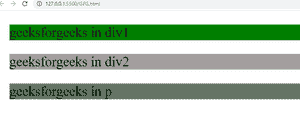
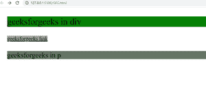

# 如何设置 CSS 中不同元素的背景色？

> 原文:[https://www . geeksforgeeks . org/如何设置 css 中不同元素的背景颜色/](https://www.geeksforgeeks.org/how-to-set-the-background-color-of-different-elements-in-css/)

在本文中，我们将学习如何在 CSS 中设置不同元素的背景色。CSS 的背景色属性用于设置元素的背景。

**方法:**利用 CSS 的背景色属性设置元素的背景。我们可以通过选择元素的类名 id name 来设置背景色，然后对其应用 background-color 属性来设置背景色。

**语法:**

```css
background-color: color_name;
```

下面的例子说明了这种方法。

**例 1:**

## 超文本标记语言

```css
<!DOCTYPE html>
<html lang="en">
  <head>
    <style>
      div{
        margin:50px 50px;
        font-size: 50px;
      }
      .gfg1{
        background-color: green;
      }
      .gfg2{
        background-color: rgb(163, 158, 158);
        color: black;
      }
      .gfg3{
        background-color: rgb(102, 119, 102);
      }
    </style>
  </head>
  <body>
    <div class="gfg1">
      geeksforgeeks in div1
    </div>  
    <div class="gfg2">
      geeksforgeeks in div2
    </div>
    <p class="gfg3" 
       style="margin:50px 50px; font-size: 50px;">
      geeksforgeeks in p
    </p>

  </body>
</html>
```

**输出:**



**例 2:**

## 超文本标记语言

```css
<!DOCTYPE html>
<html lang="en">
  <head>
    <style>
      div{
        margin:50px 50px;
        font-size: 50px;
      }
      .gfg1{
        background-color: green;
      }
      .gfg2{
        background-color: rgb(163, 158, 158);
        color: black;
        margin:50px 50px;
        font-size: 30px;
      }
      .gfg3{
        background-color: rgb(102, 119, 102);
      }
    </style>
  </head>
  <body>
    <div class="gfg1">
      geeksforgeeks in div
    </div>  
    <a class="gfg2" 
       href="https://www.geeksforgeeks.org/">
      geeksforgeeks link
    </a>
    <p class="gfg3" 
       style="margin:50px 50px; font-size: 40px;">
      geeksforgeeks in p
    </p>

  </body>
</html>
```

**输出:**

